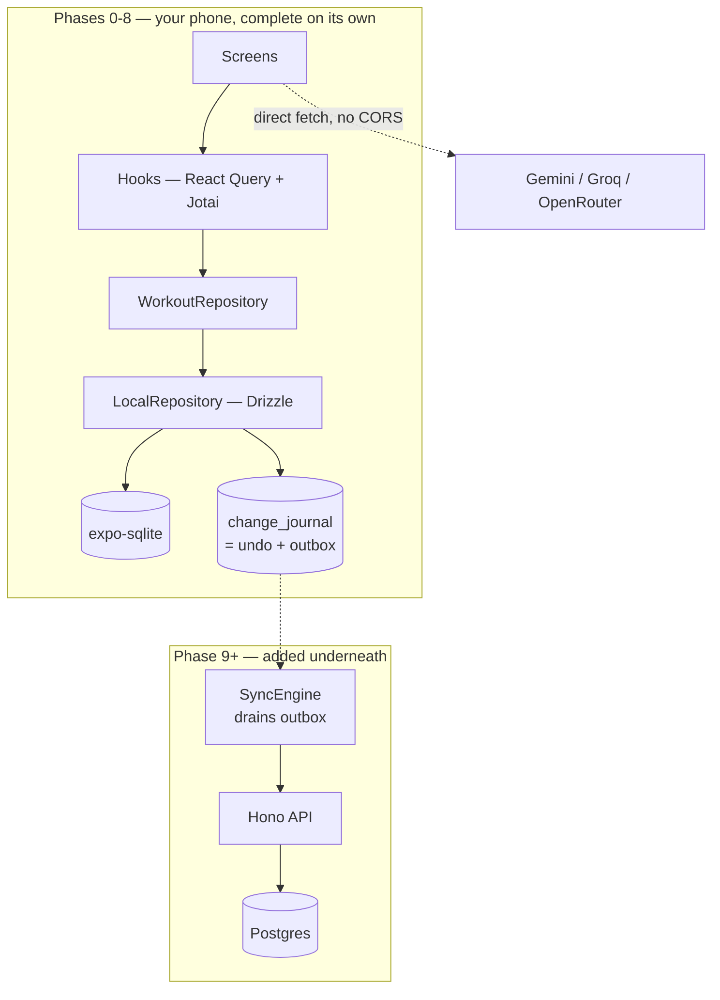

# fitai — Development Plan

An offline-first gym logger for workouts and body weight. A React Native app that
works with no signal, stores everything on your phone, and has an LLM assistant with
your real training history as context — architected so a backend, login, and Play
Store release can be added later without rewriting anything.

Status: **Phases 0–1 built and shipping.** This document is the agreed direction;
**[docs/NEXT.md](./docs/NEXT.md) supersedes it wherever the two disagree.**

> **Diagrams and folder structure:** [docs/ARCHITECTURE.md](./docs/ARCHITECTURE.md)
> **Rules for contributors and LLMs:** [CLAUDE.md](./CLAUDE.md)
> **What's next, and one correction:** [docs/NEXT.md](./docs/NEXT.md)

> **Correction.** This plan assumed **no fixed training program**, so sessions are
> built ad hoc. That was wrong: there is a fixed 7-day routine, varied only ~5–10%
> when equipment is busy or time is short. The app therefore makes you add every
> exercise every session, which is the wrong shape. The routine-first design that
> replaces it is in **[docs/NEXT.md](./docs/NEXT.md) §1**, recorded in
> **[docs/adr/0007](./docs/adr/0007-routine-first-training-model.md)**; every "no
> fixed program" statement below is superseded by it. Schema, repository, and the
> Today checklist are built; the routine's actual content (the real exercises and
> targets) is not yet seeded — see ADR 0007's "Rejected" section for why.

---

## 1. What we're building

| # | Requirement | Where |
|---|---|---|
| 1 | Log workouts on a phone, fast, mostly by hand | §7 |
| 2 | Log body weight without retyping it from Fitelo | §11 |
| 3 | Log substitutions with the date, so they're queryable | §9 |
| 4 | Zero cost, everything on the phone | §2, §16 |
| 5 | Ask an LLM for a replacement or a quick session, in the gym | §8, §10 |
| 6 | LLM has profile + workout + weight context | §10 |
| 7 | Free LLM to start, providers pluggable | §10 |
| 8 | Several LLMs answering concurrently, side by side | §10 |
| 9 | Rewind anything the LLM does that you don't like | §13 |
| 10 | **Backend, login, and Play Store later — without a rewrite** | §5, §15 |

---

## 2. Architecture in one page

**Today: the phone is the whole system.** A SQLite file in the app's private storage.
No server, no account, nothing deployed, nothing to pay for.

**Later: a backend is added underneath, not in front.** The app keeps writing to local
SQLite — Play Store users go to basement gyms too. A sync engine drains an outbox to a
server in the background. **No screen changes.**



The whole design rests on one rule: **nothing above the repository knows where data
lives.** §5 explains how that's enforced.

Full diagrams — layers, request flows, sync, LLM tool calls — are in
[docs/ARCHITECTURE.md](./docs/ARCHITECTURE.md).

---

## 3. Why Expo and React Native

You want to learn React Native, and it's also the right technical call here:

1. **Background rest timer works.** `expo-notifications` schedules through Android's
   AlarmManager — fires with the app closed. A web app cannot do this.
2. **Health Connect is reachable** — which may solve the Fitelo problem outright (§11).
3. **Storage is a real app sandbox.** No eviction, no "clear browsing data" wiping it.
4. **No CORS limits on LLM providers.** A native `fetch` isn't a browser request, so
   every provider is available — not just the ones that allow web origins.
5. **API keys go in the Android Keystore** via `expo-secure-store`.

**Expo, not bare React Native**: managed native modules, Fast Refresh comparable to
Vite HMR, and EAS Build for APKs without fighting Gradle.

**Distribution:** sideloaded APK during development (`eas build -p android --profile
preview`), Play Store at Phase 10.

**One thing to know:** Expo Go can't load arbitrary native modules. The moment Health
Connect arrives (Phase 8) you need a *development build* — a one-time setup. Phases
0–7 run in Expo Go.

---

## 4. Stack

TypeScript everywhere — app, shared packages, and the eventual backend. That's what
lets the phone and server share the schema, the validators, and the LLM tool
definitions instead of duplicating them.

### App

| Concern | Pick | Why |
|---|---|---|
| Framework | **Expo + Expo Router** | File-based routing, typed routes, managed native modules |
| Styling | **NativeWind v4** | Tailwind syntax in React Native — closest to the web workflow you know |
| **Server/async state** | **TanStack Query (React Query)** | Caching, invalidation, optimistic updates, retries. Wraps the repository, so it works identically over local SQLite now and over HTTP later. |
| **Client/UI state** | **Jotai** | Atoms for the active session draft, rest timer, selected providers, chat columns |
| Persisted preferences | **`react-native-mmkv`** + `atomWithStorage` | Much faster than AsyncStorage |
| Database | **`expo-sqlite`** | Real native SQLite |
| ORM + migrations | **Drizzle** + drizzle-kit | One schema definition targets SQLite on device and Postgres on the server |
| Validation | **zod** | Every tool call, every import, every API payload |
| Secrets | **`expo-secure-store`** | API keys in the Android Keystore |
| Notifications | **`expo-notifications`** | Background rest timer |
| Backups | **`expo-file-system`** (SAF) + `expo-sharing` | Write to a Drive-synced folder |
| Health data | **`react-native-health-connect`** | Phase 8 |
| Charts | **`victory-native` (XL)** | Skia-backed |
| Bottom sheets | **`@gorhom/bottom-sheet`** | The swap sheet, weight sheet |
| Animation/gesture | **Reanimated + Gesture Handler** | Swipe-to-swap |
| Lists | **`@shopify/flash-list`** | Long set/history lists stay smooth |
| Testing | **Vitest** + React Native Testing Library, **Maestro** for E2E | |

### The state-ownership rule

One line, and it settles every future "where does this go?" argument:

> **React Query owns anything that lives in the database.
> Jotai owns anything that doesn't.**

| Example | Owner |
|---|---|
| Past sessions, sets, body weights, routines | React Query |
| Which exercise the swap sheet is open for | Jotai |
| Rest timer countdown | Jotai |
| Draft set values before you tap save | Jotai |
| Selected LLM providers for side-by-side | Jotai |
| Chat threads and messages (persisted) | React Query |

We deliberately do **not** use Drizzle's `useLiveQuery` as the main read path. It's
simpler for pure-local reactive reads, but it has no story for a server, and mixing
two data-fetching mechanisms is exactly the kind of thing that makes a codebase hard
to follow. One way to read data. Recorded as an ADR.

### Backend (Phase 9, not before)

| Concern | Pick |
|---|---|
| Framework | **Hono** — runs unchanged on Node, Cloudflare Workers, Deno, Bun, so no hosting lock-in |
| Database | **Postgres** (Neon or Supabase) |
| ORM | **Drizzle** — same schema files as the app |
| Auth | **Better Auth** — self-hosted, Drizzle-native, supports the account-deletion flow Play Store requires |
| Local dev | **Docker Compose**, or point at a free Neon DB and skip Docker |
| Phone → laptop during dev | **Tailscale** — free, nothing publicly exposed |

---

## 5. Built now so the backend is easy later

This is the part that makes Phase 9 small. All of it lands in Phase 0.

### Rule 1 — nothing touches the database except the repository

```ts
// packages/core/src/repository.ts
export interface WorkoutRepository {
  getSessions(q: SessionQuery): Promise<Result<Paginated<Session>>>;
  getLastPerformance(exerciseId: string): Promise<Result<Performance | null>>;
  logSet(input: LogSetInput): Promise<Result<Set>>;
  replaceExercise(input: ReplaceExerciseInput): Promise<Result<SessionExercise>>;
}
```

A component that calls `db.select().from(sets)` has to be rewritten in Phase 9. One
that calls `repo.logSet(...)` never does. This single discipline is most of the benefit.

### Rule 2 — six decisions that cost nothing now

| Decision | Why now |
|---|---|
| **Every operation is `async`** | SQLite is instant, the network isn't. Sync code now means every call site changes later. |
| **Wire-shaped data** — ISO date strings, plain objects, no class instances | The same type is valid locally and remotely; no conversion layer to add |
| **`Result<T>` instead of throwing** | Declare `network`, `conflict`, `unauthorized` variants now, unused. Phase 9 adds `switch` cases instead of retrofitting error handling into every screen. |
| **Pagination in every list signature** | `getSessions({ limit, cursor })` — local ignores `cursor`. Otherwise every list call changes. |
| **Client-generated UUIDs** | Offline creates can't wait for a server to assign an ID. |
| **Mutations shaped like endpoints** | `logSet(input)` maps to `POST /sets`. Designing payloads now designs the API for free. |

```ts
type Result<T> = { ok: true; data: T } | { ok: false; error: AppError };

type AppError =
  | { kind: 'not_found' }
  | { kind: 'validation'; issues: ZodIssue[] }
  | { kind: 'conflict'; serverUpdatedAt: string }  // unused until Phase 9
  | { kind: 'network' }                            // unused until Phase 9
  | { kind: 'unauthorized' };                      // unused until Phase 9
```

### Rule 3 — the API is consumed by a sync engine, not by screens

The obvious plan is "swap `LocalRepository` for `HttpRepository`". **Don't** — that
breaks offline logging, which is the whole point.

Local SQLite stays the primary store forever. Phase 9 adds a background sync engine.
Screens keep calling the same repository and genuinely do not change. Only auth and
the LLM proxy are called directly from the UI, and those are new screens anyway.

### Rule 4 — the change journal is already the outbox

The `change_journal` (§13) records every mutation with entity, operation, and
before/after state. Add one column:

```ts
change_journal { …, synced_at: string | null }
```

Rows with `synced_at = null` are pending sync. **One table serves both undo and sync**,
so Phase 9 introduces no new queuing mechanism — it reads a table that's been filling
correctly since Phase 1.

### Rule 5 — contract-first

`packages/contract` holds the operation names, zod payload schemas, and response
types. The local repository implements the contract now; Hono routes implement the
same contract in Phase 9, and Hono's RPC client gives end-to-end type safety with no
codegen. By then the endpoints, payloads, and error taxonomy have been exercised for
months.

### Rule 6 — multi-tenant schema from day one

You want Play Store eventually, so the expensive retrofit — **scoping every query by
user** — is avoided by never writing an unscoped one.

```ts
users        (id, email, display_name, is_local, …)
sessions     (id, user_id, …)
sets         (id, user_id, …)
body_weights (id, user_id, …)
```

Locally you seed one row with `is_local: true`, and every query goes through
`currentUserId()`. It looks like over-engineering for one person, and it's the
difference between "add login" being a feature and being a refactor.

**No auth, no server, no cloud DB yet** — just the shape. Still ₹0, still offline.

---

## 6. Data model

Every table carries `id` (uuid), `user_id`, `created_at`, `updated_at`, `deleted_at`
(soft delete). Retrofitting that set is painful; adding it now is free, and it's
exactly what sync engines require.

| Table | Purpose |
|---|---|
| `users` | Local user now; real accounts at Phase 9 |
| `profile` | Height, birth year, goals, units, preferences. LLM context. |
| `exercises` | Library — name, muscles, equipment, aliases. Seeded. |
| `exercise_substitutes` | Directed pairs with a quality score. Seeded, then reinforced by your history. |
| `routines` / `routine_versions` / `routine_exercises` | Optional saved templates, **versioned** (§9) |
| `sessions` | One gym visit. Date, `origin`, duration, bodyweight, notes. |
| `session_exercises` | Holds `planned_exercise_id` + `substitution_reason` — §9 lives here |
| `sets` | weight, reps, RPE, set type, completed |
| `body_weights` | date, weight, `source` (`manual`/`health_connect`/`llm`/`import`) |
| `chat_threads` / `chat_messages` | `provider_id` per message, so side-by-side answers persist |
| `change_journal` | Every mutation + `synced_at`. Undo **and** outbox. |
| `settings` | Preferences. API keys live in SecureStore, never here. |

Index `sets` on `(user_id, session_exercise_id)` and `(user_id, exercise_id, created_at)`.

Realistic size: ~125 sets/week ≈ 2–5 MB/year including the journal.

---

## 7. Making manual logging fast

You'll mostly log by hand, so the app is judged here. Target: **a set logged in one
tap, a full session in under 90 seconds of screen time.**

> **Never show an empty form.** Opening an exercise pre-fills exactly what you did
> last time — same weight, same reps, same set count. The common case becomes
> confirmation rather than data entry.

1. **"Same as last time"** — one tap logs the whole exercise
2. **Repeat-set button**, thumb-reachable at the bottom. Tap, tap, tap — three sets.
3. **Steppers, not keyboards** — per-exercise increments (2.5 kg default, 1 kg for
   lateral raises, 5 kg for deadlift), long-press to accelerate
4. **Auto rest timer** — a real scheduled notification, fires with the app closed
5. **Quick-entry text**: `bp 60x8x3`
6. **Voice entry**: "bench press sixty kilos eight reps" → confirmation chip
7. **Fully offline** — logging never touches the network
8. **Body weight**: one sheet, date defaults to today, value defaults to last entry

Items 1–4 and 7–8 are Phase 2 and carry nearly all the speed. 5–6 are polish.

---

## 8. Planning a session

> **Superseded by [docs/NEXT.md](./docs/NEXT.md) §1 and
> [docs/adr/0007](./docs/adr/0007-routine-first-training-model.md).** This section
> assumed no fixed program, so "what am I doing today?" was framed as a choice
> between four equally-likely modes. In fact Today defaults to whatever the active
> routine's cycle says, computed from its `anchorDate` — "From a routine" below is
> now the common path, not an optional one. The other three modes are unchanged and
> still exist, for days with no active routine or a session that intentionally
> departs from it.

Four ways to start, all one tap from home:

| Mode | `origin` | What it does |
|---|---|---|
| **Repeat** | `repeat` | Re-runs a previous session, prefilled. Probably your default. |
| **Ad hoc** | `adhoc` | Empty session, add as you go |
| **From a routine** | `routine` | If you've saved one. Optional, never required. |
| **Generated** | `generated` | "I have 30 minutes, build me something" |

`suggest_session` reads the last two weeks, weights toward neglected muscle groups,
and avoids anything trained in the last 48 hours.

**Save-as-routine after the fact.** Any session you liked gets a "save as routine"
button, so templates accumulate from what you actually did rather than what you
planned up front.

**The plan of record:** whichever mode you start in, the session's initial exercise
list is snapshotted. This is what makes §9 work without a fixed program —
"substitution" needs something to have been planned, and now there always is one.

---

## 9. Substitutions, and today vs. next week

A substitution is **not** a separate kind of entry. It's a normal `session_exercises`
row that remembers what it replaced:

```ts
{
  session_id:          "…",
  exercise_id:         "hack-squat",      // what you actually did
  planned_exercise_id: "leg-press",       // from the plan of record
  substitution_reason: "equipment_busy",  // busy | time | injury | preference | closed | other
}
```

**Two taps:** tap Swap → pick from a ranked list (substitutes you've *actually used
before* first, then same-muscle/same-equipment candidates). Reason defaults to
"equipment busy".

Because it's structured data rather than a free-text note, it becomes answerable:

- "What do I usually do when the leg press is taken?"
- "How often did I skip leg press last month, and why?"
- "Is my hack squat progressing as well as my leg press was?"

### Scope: today, or from now on?

**Every LLM-driven change defaults to `scope: 'today'`. Next week is unaffected.**

```ts
replace_exercise({
  session_date, planned_exercise, new_exercise,
  scope: 'today' | 'routine',   // defaults to 'today'
  reason: 'equipment_busy' | 'time' | 'preference' | 'injury'
})
```

| What you say | Scope | Next week |
|---|---|---|
| "Leg press is taken, what instead?" | today | Unchanged |
| "No time, make it quick" | today | Unchanged |
| "I don't like this exercise" | **ambiguous → the model asks** | Depends on your answer |
| "Swap leg press for hack squat in my program" | routine | Permanent |

- **`scope: 'routine'` always requires your confirmation.** The model proposes a diff,
  you approve. This is a security boundary as much as a UX one (§12).
- **Promotion by pattern.** Swapped 4 of the last 5 sessions? The app asks once.
  Suggested, never automatic.
- **Routines are versioned**, so editing one today doesn't make last month's sessions
  retroactively look like deviations.

---

## 10. The LLM layer

### Context builder

Assembles profile, recent sessions (compacted), body-weight trend as weekly averages,
current PRs, and recent substitutions with reasons. **Token-budgeted** with a defined
trim order, **versioned**, and **cached** with invalidation on write. The same builder
feeds the in-app chat and the MCP prompts, so they can't drift.

**Per-request context toggles** let you exclude profile or body weight (§12).

### Provider registry

```ts
interface LLMProvider {
  id: string;
  label: string;
  models: string[];
  stream(req: ChatRequest): AsyncIterable<Chunk>;
}
```

One adapter file plus a registry entry per provider. **No CORS constraint**, so every
provider is available. Free options to start (verify current limits — free tiers
change): **Gemini**, **OpenRouter**, **Groq**, and **Ollama** on your laptop.

### Parallel, side by side

`Promise.allSettled` across selected providers, each streaming into its own column.
**Failure is isolated** — `allSettled`, not `all`, so one provider timing out leaves
the others streaming. Per-column latency, token count, and error state. Pin the best
answer to save it.

### Tools

`packages/tools` is the single definition of what an LLM may do to your data — used
by in-app function calling and by the optional MCP wrapper (Phase 11). Narrow, typed,
zod-validated. **No `delete_all`, no `execute_sql`, no general-purpose tool.**

---

## 11. Body weight, Fitelo, and Health Connect

**Fitelo has no public API**, and scraping it is out — brittle and likely against
their terms. But going native opens a path the browser couldn't reach.

**Health Connect** is Android's shared health store. **If Fitelo writes your body
weight there, fitai can read it automatically** — no screenshots, no OCR, no scraping.

**Confirmed: Fitelo can connect to Health Connect.** Whether the values it writes are
*accurate* is unverified, so Phase 5 opens with a spike — log a weight in Fitelo, see
exactly what arrives in Health Connect and when.

This is why `body_weights.source` exists from Phase 0. Every reading records where it
came from (`manual` / `health_connect` / `llm` / `import`), which means:

- A manual entry always wins over a Health Connect one for the same date
- You can see at a glance which numbers came from where
- If the spike shows Fitelo's values are unreliable, you turn the sync off and lose
  nothing — manual and LLM entry still work exactly as before

Fallbacks in order: BLE smart scale → screenshot read by an LLM and bulk-imported
(duplicate dates skipped, so re-sending is safe) → CSV export if Fitelo has one →
manual entry, always two taps. **The LLM can log body weight from Phase 6**, so Health
Connect is a convenience, never a dependency.

---

## 12. Security

Single user, no server, no exposed surface — risk is low, and going native removed the
largest threat outright.

**XSS is gone.** In the PWA plan the top risk was script injection via rendered model
output. React Native has no DOM and no HTML — markdown renders to native components,
and there is no path from model text to executing code.

**API keys are properly protected** — `expo-secure-store` uses the Android Keystore,
hardware-backed on most modern devices.

### Remaining real risks

**1. Prompt injection — the main one, because the LLM holds write tools.** Untrusted
text reaches the model via screenshots or pasted exercise names.

- The confirmation gate on `scope: 'routine'` is the boundary
- **No `delete_all`, no `execute_sql`, no general-purpose tool** — a capability that
  doesn't exist can't be abused
- Every tool argument zod-validated; OCR'd text is data, never instructions

**2. Supply chain.** A malicious npm package ships inside your APK with full app
permissions. Few dependencies, committed lockfile, Dependabot on.

**3. Sideloading hygiene.** Only install APKs you built yourself.

**4. Key restriction.** Free tier or a hard billing cap, so a leaked key can't cost money.

### From Phase 9 (multi-user)

Row-level scoping by `user_id` on **every** query — enforced by the repository, never
left to call sites. A missed scope is a data leak between users, which is why §5
Rule 6 exists from day one. Plus: HTTPS only, rate limiting, and account deletion
(in-app *and* web) as Play Store requires.

### Not a vulnerability, but a real cost

Your workout history, body weight, and profile **are sent to Google / OpenRouter /
Groq** when you chat. Free tiers often reserve broader rights over submitted data —
check current terms. Ollama keeps everything on your own network, and the per-request
context toggles let you ask an exercise question without shipping your weight history.

---

## 13. Backup and rewind

### Change journal — undoing the LLM

```ts
{ id, timestamp, actor: 'user' | 'llm', provider, tool,
  entity, before_json, after_json, batch_id, synced_at }
```

One LLM turn is one `batch_id`, so **"undo that" reverts the whole turn atomically**.
Because `before_json` is stored, undo is a direct restore, not a replay of inverse
operations.

The **History screen** lists changes reverse-chronologically with actor badges —
*"Gemini modified Push A · 2 min ago · \[Undo]"*.

Combined with preview-before-commit on routine-scope changes, most unwanted edits
never land. The journal catches the rest. And per §5 Rule 4, this same table is the
sync outbox.

### Snapshots — restoring a point in time

The database is one file, so a snapshot is a file copy. Automatic after every session
plus daily; retention 7 daily + 4 weekly. **Restore** previews the snapshot before you
confirm and takes a pre-restore snapshot first, so restoring is itself undoable.

### Getting backups off the phone

1. **Storage Access Framework** — pick a folder once, the app writes there
   unprompted. Point it at a Google Drive-synced folder and off-device backup is automatic.
2. **Android auto-backup** — the OS periodically backs app data to your Drive within
   existing quota.

---

## 14. Folder structure and code conventions

The repo should be legible to someone who doesn't code, just by reading folder names.
The full tree is in **[docs/ARCHITECTURE.md](./docs/ARCHITECTURE.md)**. The principles:

- **Feature-first, not type-first.** `features/workout-logging/` beats scattering the
  same feature across `components/`, `hooks/`, and `utils/`.
- **A `README.md` in every feature folder**, in plain English: what this does, which
  screens use it, which tables it touches.
- **`docs/GLOSSARY.md`** defines domain terms — set, rep, RPE, plan of record,
  substitution scope — so nobody has to infer them from code.
- **Small components.** One job each. If a file passes ~150 lines it probably wants
  splitting; if a component takes more than ~5 props it probably wants composing.
- **Hooks hold logic, components hold layout.** A component that fetches, transforms,
  and renders is three things.
- **Named exports only**, no default exports — renames stay greppable.
- **Absolute imports** via `@/` — no `../../../`.
- **Every folder has one obvious owner.** If you can't tell where a file belongs, the
  structure is wrong, not the file.

---

## 15. Making the repo legible to an LLM

You asked how to structure this so an LLM picks up the project quickly. Four layers,
and they're the same things that help a human:

**1. `CLAUDE.md` at the root** — the entry point. What the project is, the repo map,
the invariants that must never be broken (never import `db` outside the repository;
every operation async; `Result` not exceptions; scope defaults to today; no
destructive tools), the commands, and where to look for what. Already written.

**2. `.claude/skills/` — repeatable recipes** for the tasks that recur, so the steps
aren't rediscovered each time:

| Skill | Covers |
|---|---|
| `add-llm-provider` | Adapter file, registry entry, settings UI, tests |
| `add-tool` | Contract → zod schema → implementation → journal entry → confirmation gate → tests |
| `add-migration` | Schema change, drizzle-kit generate, both dialects, backfill |
| `add-feature` | Folder scaffold, README, route, query keys |

**3. `docs/adr/` — architecture decision records.** Short numbered files: the decision,
why, and what was rejected. An LLM (or you in six months) reading `0004-react-query-not-uselivequery.md`
won't "helpfully" reintroduce the thing we deliberately declined.

**4. Feature READMEs and the glossary** (§14) — domain context that isn't inferable
from code.

The through-line: **encode intent, not just implementation.** Code shows what happens;
these show what was decided and why.

---

## 16. Phases

Each phase ends with something usable.

| Phase | Deliverable | Done when |
|---|---|---|
| **0 — Foundation** | Expo scaffold, Expo Router, NativeWind, Drizzle schema + migrations, multi-tenant `user_id`, repository interface, `Result` type, contract package, React Query + Jotai wiring, seeded exercise library, CLAUDE.md, ADRs, `.claude/skills/`, **GitHub Actions (checks + auto `eas update`) and lint rules enforcing the §5 invariants** | The app boots, the schema migrates cleanly, and CI fails if a component imports the database directly |
| **1 — Log things** | Sessions, exercises, sets, body weight, history. **Snapshots and Drive backup ship here.** | You log a real session in airplane mode and a backup lands in Drive |
| **2 — Make it fast** | §7 in full, including the background rest timer | A full session takes under 90 seconds of screen time |
| **3 — Session planning** | The four start modes, plan of record, save-as-routine, `suggest_session` | Starting a session never needs typing an exercise name |
| **4 — Substitutions** | Swap flow, history-ranked substitutes, reasons, routine versioning | Two-tap swap, and "what do I do when the leg press is taken?" has a real answer |
| **5 — Health Connect** | **Spike first:** confirm what Fitelo actually writes. Then dev build, permissions, body-weight sync, dedupe by `source` | Fitelo weights appear without typing — or the spike says they're unreliable and you keep manual + LLM entry |
| **6 — Chat with tools** | Context builder, one provider, streaming, function calling, scope model, journal + undo UI | "I have 30 minutes, build me something" works in the gym — and you can undo it |
| **7 — Multi-LLM** | Provider registry with 3+ adapters, parallel fan-out, columns, pin-best | Three columns streaming together; one failing doesn't break the others |
| **8 — Charts & polish** | Body-weight trend, per-exercise progression, PR detection, quick-entry DSL, voice | You can see whether you're actually progressing |
| **9 — Backend & multi-user** | Hono + Postgres + Better Auth under Docker Compose, sync engine draining the outbox, deployed when it must be reachable | Two devices agree, and no screen changed to make it happen |
| **10 — Play Store** | 12-tester closed test, privacy policy, Data Safety, account deletion, health-data policy | It's live |
| **11 — Desktop MCP** | `npx @fitai/mcp` over an exported DB, laptop viewer, Fitelo backfill via Claude Desktop | Bulk work from a laptop |

**Phases 1–4 are the product.** Everything after is genuinely optional.

---

## 17. What this costs

| Item | Cost |
|---|---|
| GitHub, SQLite on phone, sideloaded APK | Free |
| EAS Build | Free monthly quota; local `expo run:android` unlimited |
| Backups to Google Drive | Free within existing quota |
| Gemini / OpenRouter / Groq free tiers | Free, rate-limited |
| Ollama on your laptop | Free, unlimited, offline |
| Backend, local Docker (Phase 9) | Free |
| Backend, hosted (when others use it) | Free tiers exist; realistically ₹0–400/month for a small user base |
| Play Store registration (Phase 10) | **₹2,000 one-time** |
| Anthropic / OpenAI APIs | Pay per token — optional |

**₹0 through Phase 9.** The first unavoidable cost is Play Store registration.

**One economic warning for Phase 10:** LLM costs scale with users and you'd have no
revenue. Decide before building the proxy — **bring-your-own-key** keeps your ₹0
promise and is honestly fine for a niche lifting app; the alternatives are hard caps
per user, or charging.

---

## 18. Risks

| Risk | Mitigation |
|---|---|
| Logging isn't fast enough and you go back to a notes app | Phase 2's exit criterion is a stopwatch measurement, not an opinion |
| React Native learning curve stalls Phase 1 | Expo removes most sharp edges; Phases 0–7 run in Expo Go |
| LLM makes a change you don't want | Default `scope: 'today'`, confirmation on routine changes, full undo. Three layers. |
| Prompt injection | Narrow typed tools, zod validation, confirmation gate |
| Fitelo doesn't write to Health Connect | Screenshot import still works |
| Free LLM tiers get restricted | Provider registry makes switching one adapter; Ollama is the floor |
| Phase 9 turns into a rewrite | §5 exists entirely to prevent this |
| Scope creep across 11 phases | Phases 1–4 are the product |

---

## 19. Settled decisions

| Question | Answer |
|---|---|
| Platform | Android, React Native via **Expo** |
| Backend | **None until Phase 9** — but the schema, repository, and contract are built for it from Phase 0 |
| Database | `expo-sqlite` + Drizzle on device; Postgres on the server later |
| State | **React Query** for database-backed state, **Jotai** for UI state |
| Multi-user | Schema is multi-tenant from day one; auth at Phase 9 |
| Distribution | Sideloaded APK now, Play Store at Phase 10 |
| Training program | **Fixed 7-day cycle** (docs/NEXT.md §1, ADR 0007) — ad-hoc and generated sessions remain available for days with no active routine |
| Units | kg |
| Backups | Snapshots → Drive folder via SAF, plus Android auto-backup |

**Open action item:** check whether Fitelo writes body weight to Health Connect. If it
does, Phase 8 moves to the front.

---

*Next step: [docs/NEXT.md](./docs/NEXT.md) — routines first.*
