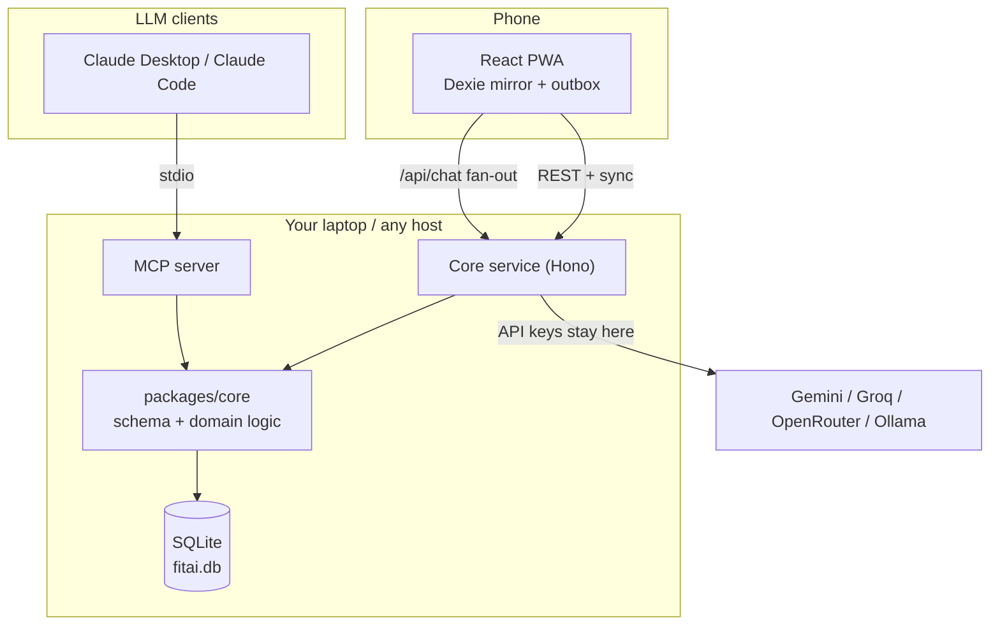

# fitai — Development Plan

An offline-first gym logger for workouts and body weight, with a local data store,
an MCP server so any LLM can read/write that data, and an in-app chat that can ask
several LLMs at once and show the answers side by side.

Status: **planning**. Nothing is built yet. This document is the agreed direction.

---

## 1. What we're building

From your requirements, in priority order:

| # | Requirement | Notes |
|---|---|---|
| 1 | Log workouts on a phone, fast, mostly by hand | The core loop. Must work with no signal, in a gym, one-handed. |
| 2 | Log body weight | Currently in Fitelo. |
| 3 | Log **substitutions** ("leg press was taken, did hack squat") with the date | So it becomes queryable history, not a lost note. |
| 4 | Store data locally now, move to cloud later without a rewrite | Drives the storage decision. |
| 5 | MCP server so an LLM can get/log weights and workouts | This is how Fitelo data gets in — see §8. |
| 6 | In-app LLM chat with your profile + workout + weight context | Ask "what should I do instead of X?" without leaving the app. |
| 7 | Start on a free LLM, make providers pluggable | Provider registry, not hardcoded. |
| 8 | Ask several LLMs concurrently, responses side by side | Fan-out + column UI. |

---

## 2. The one decision that shapes everything

Requirements 4 and 5 pull in opposite directions, and this is worth getting right
before any code is written.

- "Use my **local storage**" naturally means the browser's storage on your phone (IndexedDB).
- But an **MCP server** runs on your laptop or a small server, next to Claude Desktop / Claude Code.
  It cannot reach your phone's browser storage. Ever.

If we store data only in the phone's browser, the MCP server has nothing to read.
If we store data only on a server, the app stops working when the gym has no signal.

**Resolution: one owning service, one cache.**

- A small **local core service** (Node + SQLite file on disk) is the single source of truth.
  This is your local storage — a `fitai.db` file you own, back up, and can inspect.
- The **PWA** keeps an offline mirror plus an **outbox**. You log sets with no signal;
  they sync when you're back online. Reads come from the mirror instantly.
- The **MCP server** talks to the same core service. Same data, same rules, no duplication.

Running the core service locally today costs nothing. Moving it to a cloud host later
is a deploy, not a rewrite — that's the whole point of §12.

---

## 3. Recommended stack

**TypeScript end to end.** You already work in React/Node/Express, the MCP SDK is
first-class TypeScript, and one language across app + server + MCP means the workout
and weight types are defined once and shared.

| Layer | Pick | Why this over the alternatives |
|---|---|---|
| Mobile app | **React + Vite PWA** | Installs to your home screen, no App Store, no signing, no review. React Native/Expo adds a build pipeline and store friction for an app only you use. Revisit if you ever want Apple Health / Google Fit integration. |
| UI | **Tailwind + shadcn/ui** | Full control over tap-target sizes, which matters a lot for §6. MUI is fine if you'd rather stay on familiar ground — it's heavier and harder to tune for thumb-first layouts. |
| Offline store (phone) | **Dexie.js** (IndexedDB) | Mature, tiny API, good TypeScript support. It's a *cache + outbox*, not the source of truth, so it stays simple. |
| Core service | **Node + Hono** | Hono is small, fast, and runs unchanged on Node locally and on Cloudflare Workers / Deno / Bun later. Express works too; Hono gives you more deployment doors for free. |
| Database | **SQLite** now, **Postgres** later | One file on your disk. Zero setup, zero cost, trivial backup. |
| DB access | **Drizzle ORM** | Same schema definition compiles to SQLite *and* Postgres. The migration in §12 is mostly a connection-string change. This is the specific reason to prefer it over raw SQL or Prisma here. |
| MCP server | **`@modelcontextprotocol/sdk`** (TypeScript) | Official SDK. stdio transport for Claude Desktop / Claude Code; HTTP transport later if you want it remote. |
| Monorepo | **pnpm workspaces + Turborepo** | Shared `packages/core` used by the API, the MCP server, and the app. |
| Charts | **Recharts** | You'll want a body-weight trend line and per-exercise progression. |

### Repo layout

```
fitai/
├── apps/
│   ├── web/              # React PWA — the thing on your phone
│   ├── api/              # Hono core service (owns fitai.db)
│   └── mcp/              # MCP server (stdio + optional HTTP)
├── packages/
│   ├── core/             # Drizzle schema, domain logic, validation (zod)
│   ├── llm/              # Provider registry + context builder
│   └── types/            # Shared TS types generated from the schema
├── docs/
│   ├── adr/              # Architecture decision records
│   └── PLAN.md
└── data/
    └── fitai.db          # gitignored
```

### How the pieces talk



Two things to notice:

- The MCP server and the API share `packages/core`. There is one definition of
  "log a set", used by both. No drift.
- **LLM API keys live in the core service only.** The PWA never holds a key —
  a key shipped in a browser bundle is a public key. The app calls `/api/chat`
  and the service fans out.

---

## 4. Data model

Every table carries `id` (uuid), `created_at`, `updated_at`, and `deleted_at`
(soft delete). That trio is what makes cloud sync possible later without a migration —
adding it retroactively is painful, so it goes in from day one.

| Table | Purpose |
|---|---|
| `profile` | You: height, birth year, goals, units (kg), training preferences. Fed to the LLM as context. |
| `exercises` | Exercise library. Name, primary/secondary muscles, equipment, aliases. |
| `exercise_substitutes` | Directed pairs — "hack squat is a viable stand-in for leg press", with a quality score. Seeded, then learned from your actual history. |
| `routines` / `routine_exercises` | Your templates: Push A, Pull B, Legs. Ordered, with target sets/reps. |
| `sessions` | One gym visit. Date, routine used, duration, bodyweight that day, notes. |
| `session_exercises` | An exercise performed in a session. **Holds `planned_exercise_id` + `substitution_reason`** — this is where §7 lives. |
| `sets` | weight, reps, RPE, set type (warmup/working/drop/failure), completed flag. |
| `body_weights` | date, weight, `source` (`manual` \| `fitelo` \| `mcp` \| `import`), notes. `source` matters — you'll want to know what came from where. |
| `chat_threads` / `chat_messages` | In-app chat, with `provider_id` on each message so side-by-side answers are all persisted. |

`sets` is the highest-volume table and the one every "what did I lift last time"
query hits — index it on `(session_exercise_id)` and `(exercise_id, created_at)`.

---

## 5. Answering your question: how do we make manual logging *fast*?

You said you'll mostly log by hand. The whole app is judged on this. Target: **a set
logged in one tap, a full session in under 90 seconds of screen time.**

The single highest-leverage idea:

> **Never show an empty form.** Opening an exercise pre-fills exactly what you did
> last time for that exercise — same weight, same reps, same number of sets.
> The common case (you did the same thing, or one small step up) becomes confirmation
> rather than data entry.

Building on that:

1. **"Same as last time" button** at the top of every exercise. One tap logs the
   whole exercise as a repeat of your last session.
2. **Repeat-set button.** Most sets repeat the previous set. Big button, bottom of
   the screen, thumb-reachable. Tap, tap, tap — three sets logged.
3. **Steppers, not keyboards.** `−` and `+` at your configured increment (2.5 kg
   default, per-exercise override — 1 kg for lateral raises, 5 kg for deadlift).
   Long-press to jump. The number keypad is the fallback, not the default.
4. **Auto rest timer.** Starts when you complete a set, shows in a persistent
   header, fires a notification when done. Removes the separate stopwatch app.
5. **Routine templates.** Tap "Push A" and the session is pre-built with your
   exercises in order. You're confirming a plan, not composing one.
6. **Quick-entry text field** for power use: `bp 60x8x3` → bench press, 60 kg,
   8 reps, 3 sets. Fastest path once you know it, and it works offline.
7. **Voice entry** (Web Speech API): "bench press sixty kilos eight reps" → parsed
   into a confirmation chip you tap to accept. Nice-to-have; needs signal, so it
   never replaces 1–6.
8. **Offline-first, always.** Every action writes to the local mirror immediately
   and queues in the outbox. The UI never blocks on a network call. A gym in a
   basement must not break logging.
9. **Body weight**: one sheet, date defaults to today, value defaults to your last
   entry. Two taps to log.

Items 1–5 and 8–9 are Phase 2 and are where nearly all the speed comes from.
6 and 7 are Phase 6 polish.

---

## 6. Answering your question: substitutions

Your case: the leg press is occupied, so you do hack squats instead, and later you
want to ask an LLM what you usually do in that situation.

The design: a substitution is **not** a different kind of log entry. It's a normal
`session_exercises` row that remembers what it replaced.

```ts
{
  session_id:          "…",
  exercise_id:         "hack-squat",     // what you actually did
  planned_exercise_id: "leg-press",      // what the routine said
  substitution_reason: "equipment_busy", // busy | injury | preference | closed | other
  // date comes from the session — always recorded, never optional
}
```

In the UI it's a **"Swap" button on every planned exercise**, two taps total:

1. Tap **Swap** on Leg Press.
2. Pick from a ranked list: substitutes you've *actually used before* for this
   exercise first, then same-muscle/same-equipment candidates from the library.
   Reason defaults to "equipment busy" — the common case — and is one tap to change.

Because the link and the reason are structured data rather than free text, all of
this becomes answerable — by the LLM chat *and* by the MCP tools:

- "What do I usually do when the leg press is taken?"
- "How often did I skip leg press last month, and why?"
- "Is my hack squat progressing as well as my leg press was?"

That last one only works because the substitution keeps both exercises' identities.
Free-text notes would lose it.

---

## 7. Getting your Fitelo weights in

**Fitelo has no public API.** So let's be clear about the options:

| Approach | Verdict |
|---|---|
| Scrape Fitelo / drive their private endpoints with your login | **No.** Brittle, breaks on any app update, and likely against their terms. Not going to build this. |
| Manual re-entry in fitai | Works, but you asked to avoid it. |
| **Screenshot → LLM reads it → MCP logs it** | **Yes.** This is the plan. |
| CSV/data export, if Fitelo offers one | Best if it exists — check your account settings. A one-shot `import_body_weights` tool handles it. |

The screenshot flow, concretely: you screenshot your Fitelo weight history, drop it
into Claude, and say "log these to fitai". Claude reads the values and calls
`log_body_weight` once per entry through the MCP server. Duplicate dates are
detected and skipped, so re-sending an overlapping screenshot is safe.

Phase 6 can add a **Web Share Target**, so fitai appears in your phone's share sheet
and you can share a Fitelo screenshot straight into the app for OCR and confirmation —
no laptop involved. That's the nicest version, but the MCP path works first and needs
no extra infrastructure.

---

## 8. MCP server surface

Runs over stdio for Claude Desktop and Claude Code. Every write is validated by the
same zod schemas the API uses.

**Tools**

| Tool | Purpose |
|---|---|
| `log_body_weight` | date, weight, source, notes. Idempotent on date. |
| `get_body_weights` | Range query, optional weekly averaging (daily weight is noisy — the trend is the signal). |
| `import_body_weights` | Bulk insert from a parsed screenshot or export. Skips existing dates. |
| `log_workout` | A whole session in one call: exercises, sets, substitutions. |
| `log_set` | Append a single set to today's session. |
| `log_substitution` | Record a swap with planned/actual/reason/date. |
| `get_workout_history` | Filter by exercise and date range. |
| `get_last_performance` | "What did I do for bench last time?" — the most-called tool, worth its own entry. |
| `suggest_substitutes` | Given an exercise + available equipment, rank alternatives using your history first, library second. |
| `get_progress_summary` | Volume, PRs, and trend for an exercise or for body weight over a window. |
| `get_profile` / `update_profile` | Read/write your profile. |

**Resources** — `fitai://profile`, `fitai://recent-workouts`, `fitai://bodyweight-trend`,
`fitai://exercise-library`. These give the LLM background without spending a tool call.

**Prompts** — `weekly-review`, `pick-substitute`, `log-from-screenshot`.

---

## 9. The LLM layer

### Context builder

One function, `buildContext(options)`, in `packages/llm`, assembling:

- Your profile (goals, experience, constraints, units)
- Last N sessions, compacted
- Body weight trend — weekly averages, not raw dailies
- Current PRs per main lift
- Recent substitutions with reasons

It is **token-budgeted** (a target, and a defined order in which sections get
trimmed), **versioned**, and **cached** with invalidation on write. The same builder
feeds the in-app chat and the MCP prompts, so both see identical context. Building
it once and sharing it is what stops the two from drifting apart.

### Provider registry

```ts
interface LLMProvider {
  id: string;
  label: string;
  models: string[];
  stream(req: ChatRequest): AsyncIterable<Chunk>;
}
```

Adding a provider = one adapter file + a registry entry. No changes anywhere else.

**Start free** (verify current limits yourself — free tiers change often):

- **Google Gemini** — has a genuine free API tier, generous enough for personal use.
- **Groq** — free tier, and very fast, which makes the side-by-side view feel good.
- **OpenRouter** — offers some free models, and one key reaches many models.
- **Ollama** — fully free and offline if you run a model on your laptop. Zero API cost forever.

Paid adapters (Anthropic, OpenAI) are the same interface — add a key when you want one.

### Parallel, side-by-side

You select 2–3 providers; the service fans out with `Promise.allSettled` and streams
each response back over SSE tagged by provider id. Each column renders independently.

- **Failure is isolated.** One provider erroring or timing out leaves the others
  streaming. `allSettled`, not `all` — that's the whole trick.
- Per-column status: latency, token count, model name, error state.
- On mobile: horizontal snap-scroll columns. On desktop: a grid.
- **Pin the best answer** to save it to the thread or attach it to a workout note.

---

## 10. Phases

Each phase ends with something you can actually use.

### Phase 0 — Foundation
Monorepo, TypeScript config, Drizzle schema, seed exercise library, ADRs for the
decisions in §2 and §3. CI running typecheck + tests.
*Done when:* `pnpm dev` starts app and API, and the schema migrates cleanly.

### Phase 1 — Log things (the milestone that matters)
Core service + SQLite. PWA that installs to your home screen. Create a session, add
exercises, log sets, log body weight. Offline mirror + outbox sync.
*Done when:* **you log a real gym session on your phone, in airplane mode, and it syncs after.**

### Phase 2 — Make it fast
Everything in §5: last-time prefill, "same as last time", repeat-set, steppers with
per-exercise increments, routine templates, rest timer, two-tap body weight.
*Done when:* a full session takes under 90 seconds of screen time.

### Phase 3 — Substitutions
Swap flow, substitute ranking from history, substitution history view, reasons.
*Done when:* you can swap an exercise in two taps and later ask "what do I do when the leg press is taken?"

### Phase 4 — MCP server
Full tool + resource + prompt surface from §8. Wired into Claude Desktop and Claude Code.
*Done when:* you paste a Fitelo screenshot into Claude and your weights land in fitai.

### Phase 5 — In-app chat, one provider
Context builder, Gemini or Groq adapter, streaming chat UI, thread persistence.
*Done when:* you can ask "should I deload?" in the app and get an answer grounded in your actual data.

### Phase 6 — Multi-LLM side by side
Provider registry with 3+ adapters, parallel fan-out, column UI, pin-best-answer,
per-provider settings.
*Done when:* one question, three columns, streaming together, and one failing doesn't break the others.

### Phase 7 — Polish and analytics
Charts (body weight trend, per-exercise progression, volume), PR detection, Web Share
Target for screenshots, quick-entry DSL, voice entry, CSV export.

Phases 1–3 are the app you'd use daily even if everything after them were cancelled.
That ordering is deliberate.

---

## 11. Moving to the cloud later

The design keeps this cheap. When you want it:

1. **Database** — Drizzle's schema is dialect-portable. Point it at Postgres
   (Neon, Supabase) or Turso (SQLite-compatible, so even less changes). Migrate the
   file with a one-off script.
2. **Service** — the Hono app deploys to Fly.io, Railway, Render, or Cloudflare
   Workers unchanged.
3. **Auth** — the only genuinely new work. Single-user local means no auth today;
   add it before the service is publicly reachable. This is the one item to not
   defer past "the day it gets a public URL".
4. **Sync** — the outbox already exists from Phase 1. Multi-device needs conflict
   resolution: last-write-wins on `updated_at` is sufficient for a single-user app
   with one active device at a time.
5. **App** — deploy the PWA to Vercel/Netlify, change the API base URL. That's it.

The things that make this easy — uuid keys, `updated_at`/`deleted_at`, an outbox,
a dialect-portable ORM — all land in Phase 0 and Phase 1. They're nearly free then
and expensive to retrofit.

---

## 12. What this costs to run

You asked, so here's the honest accounting.

| Item | Cost |
|---|---|
| GitHub repo | Free |
| Local core service + SQLite on your laptop | Free |
| PWA hosting (Vercel / Netlify / Cloudflare Pages) | Free tier is plenty for one user |
| Gemini free tier | Free, with rate limits |
| Groq free tier | Free, with rate limits |
| OpenRouter free models | Free, with rate limits |
| Ollama on your laptop | Free, unlimited, offline, but needs decent RAM |
| Anthropic / OpenAI APIs | **Pay per token — no free tier.** Optional; only if you add them. |
| Cloud host for the service (Phase 11) | Free tiers exist (Fly.io, Railway, Render); realistically $0–5/month for one user |

So: **₹0 for the whole of Phases 0–6** if you stay on free-tier LLMs or Ollama.
Free-tier terms change — check current limits before relying on any of them.

One correction to something I told you earlier in this conversation: I said Anthropic
and OpenAI have free tiers with credits. That was wrong — both are pay-as-you-go.
The genuinely free options are Gemini, Groq, OpenRouter's free models, and Ollama.

---

## 13. Risks

| Risk | Mitigation |
|---|---|
| Logging isn't fast enough and you go back to a notes app | Phase 2 exists for exactly this, and its exit criterion is a stopwatch measurement, not an opinion. |
| Fitelo changes its UI and screenshots parse badly | The flow is LLM vision, not a scraper — it degrades gracefully, and manual entry always works. |
| Free LLM tiers get restricted | Provider registry means switching is one adapter. Ollama is the floor — it can't be taken away. |
| Sync bugs lose a workout | Outbox is append-only; entries clear only on server ack. Local mirror is never the loser in a conflict for un-synced writes. |
| Scope creep across 7 phases | Phases 1–3 are the real product. 4–7 are genuinely optional. |

---

## 14. Open questions for you

1. **Units** — kg throughout, I've assumed. Confirm?
2. **Where will the core service run?** Your laptop (only syncs at home), or a cheap
   always-on host from the start (syncs anywhere)? This affects Phase 1's sync design.
3. **Does Fitelo offer any data export?** Worth checking your account settings — a
   CSV export would beat screenshots for backfilling history.
4. **Routines** — do you follow a fixed program (PPL, Upper/Lower, 5x5) I should seed
   as templates, or do you build sessions ad hoc?
5. **iPhone or Android?** Both work as PWAs; iOS has some restrictions around
   notifications and background sync that would affect the rest timer.

---

*Next step: agree on this plan, then Phase 0.*
