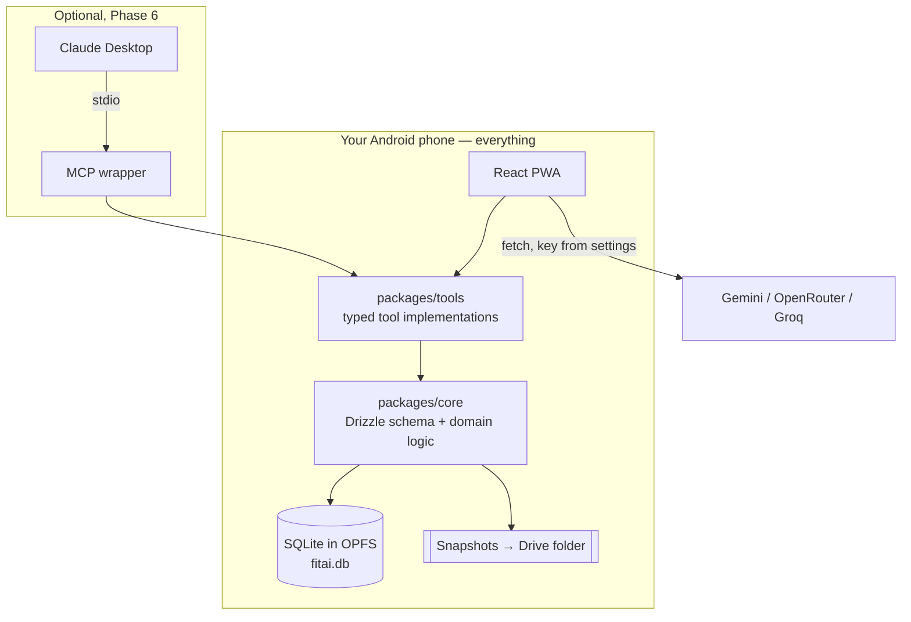

# fitai — Development Plan

An offline-first gym logger for workouts and body weight. Everything lives on your
Android phone, costs nothing to run, and can be asked questions by an LLM that has
your actual training history as context.

Status: **planning**. Nothing is built yet. This document is the agreed direction.

**Target device: Android.** **No fixed training program** — sessions are built ad hoc
or generated, not driven by a rigid template. Both facts shape decisions throughout.

---

## 1. What we're building

| # | Requirement | Where it's addressed |
|---|---|---|
| 1 | Log workouts on a phone, fast, mostly by hand | §6 |
| 2 | Log body weight | §6, §10 |
| 3 | Log substitutions with the date, so they're queryable | §8 |
| 4 | Zero cost, everything stored on the phone | §2, §14 |
| 5 | Ask an LLM for a replacement or a quick session, in the gym | §7, §9 |
| 6 | LLM has profile + workout + weight context | §9 |
| 7 | Free LLM to start, providers pluggable | §9 |
| 8 | Several LLMs answering concurrently, side by side | §9 |
| 9 | Rewind anything the LLM does that you don't like | §12 |

---

## 2. Architecture: one device, no server

**The phone owns everything.** There is no backend, no host, no sync service, no
account. A single SQLite database file lives in the browser's private storage on
your phone, and the app reads and writes it directly.

This is what makes the whole thing free — there is nothing to pay for because there
is nothing running anywhere else.

### What this means for MCP

Worth being explicit, because it changed the plan: **MCP is not how the in-gym
assistant works.**

MCP is a protocol for a *desktop* LLM client (Claude Desktop, Claude Code) to spawn
a local process over stdio. Your phone has no Node runtime and no MCP client, so
"ask for a replacement while standing at the leg press" cannot run over MCP.

What serves that use case is **LLM function-calling inside the app**: the app sends
the model your context plus a list of typed tools, the model calls them, the app
executes them against local SQLite. No infrastructure, works offline for everything
except the model call itself.

So the tool layer is built **once and exposed twice**:

- **In-app function calling** — primary. On your phone. What you use daily.
- **A thin MCP wrapper** (`npx @fitai/mcp --db fitai.db`) — optional, Phase 6. Run
  from a laptop against an exported database file when you want Claude Desktop for
  bulk work like backfilling Fitelo history. Spawned on demand, exits when done —
  exactly the "only when I ask" model.

Both call the same implementations in `packages/tools`. No drift between them.



---

## 3. Why a PWA and not a native app

An installable PWA, built with React. The reasoning:

1. **Zero cost.** No developer account, no store fees.
2. **No build toolchain.** No Android Studio, no signing, no store review. Push to
   Vercel and your phone has the new version on next open — which matters most in
   Phase 6, where you'll want to try several logging-flow variants in a week.
3. **You already work in React.** Productive on day one.

On Android specifically, the usual PWA compromises barely apply: Chrome grants
storage persistence readily, notifications work well enough for a rest timer, and
the File System Access API gives real folder access for backups. On iOS all three
would have been weak — Android is the platform where this choice is nearly free.

### The escape hatch

**Capacitor wraps the same React build in a native shell.** If OPFS eviction or
notifications ever become a real problem, adding it is a few days' work and touches
no UI code — and on Android it stays free (sideload the APK; no Apple-style $99/yr).

The one thing that must be right from the start is keeping storage behind an interface:

```ts
interface StorageAdapter {
  query(sql: string, params?: unknown[]): Promise<Row[]>;
  exec(sql: string, params?: unknown[]): Promise<void>;
  exportDb(): Promise<Uint8Array>;
  importDb(bytes: Uint8Array): Promise<void>;
}
```

`OpfsSqliteAdapter` today, `CapacitorSqliteAdapter` if ever needed. One-line swap,
same Drizzle schema above it. This lands in Phase 0 so the door stays open for free.

---

## 4. Stack

**TypeScript throughout** — the app, the tools, the schema, and the optional MCP
wrapper share one type system, so a workout is defined exactly once.

| Layer | Pick | Why |
|---|---|---|
| App | **React + Vite**, built as an installable PWA | See §3. |
| UI | **Tailwind + shadcn/ui** (Radix) | Full control of tap-target sizes, which §6 depends on. |
| Offline shell | **Workbox** via `vite-plugin-pwa` | App loads and runs with no signal. |
| Database | **SQLite-WASM in OPFS** | Real SQL for history queries, and a single portable `.db` file — which is what makes backups (§12) and the MCP wrapper possible. |
| DB access | **Drizzle ORM** | Schema is dialect-portable, so the cloud move in §15 is mostly a connection change. |
| Validation | **zod** | Every tool call and every import validated. Model output is untrusted input. |
| Charts | **Recharts** | Body-weight trend, per-exercise progression. |
| LLM | Direct `fetch` to **Gemini / OpenRouter / Groq**; optional **Ollama** | §9. |
| MCP (Phase 6) | `@modelcontextprotocol/sdk` + better-sqlite3 | Laptop only. |
| Tooling | pnpm workspaces, Turborepo, Vitest, Playwright, ESLint, GitHub Actions | |

Deliberately **absent**: no server, no auth, no cloud DB, no analytics SDK. Each of
those would be a component to secure and pay for. The smallest system is the safest one.

### Repo layout

```
fitai/
├── apps/
│   ├── web/              # The PWA — the whole product
│   └── mcp/              # Phase 6: optional laptop wrapper
├── packages/
│   ├── core/             # Drizzle schema, domain logic, StorageAdapter
│   ├── tools/            # Typed tool impls — shared by in-app chat AND mcp
│   └── llm/              # Provider registry + context builder
├── docs/adr/             # Architecture decision records
└── PLAN.md
```

`packages/tools` is the important one: it is the single definition of what an LLM is
allowed to do to your data, whichever way it connects.

---

## 5. Data model

Every table carries `id` (uuid), `created_at`, `updated_at`, `deleted_at` (soft
delete). Retrofitting that trio later is painful; adding it now is free, and it is
what makes §15 possible.

| Table | Purpose |
|---|---|
| `profile` | Height, birth year, goals, units, training preferences. Fed to the LLM as context. |
| `exercises` | Exercise library — name, primary/secondary muscles, equipment, aliases. Seeded. |
| `exercise_substitutes` | Directed pairs with a quality score: "hack squat stands in for leg press". Seeded, then reinforced by your actual history. |
| `routines` / `routine_versions` / `routine_exercises` | Optional saved templates. **Versioned** — see §8. |
| `sessions` | One gym visit. Date, `origin`, duration, bodyweight, notes. |
| `session_exercises` | An exercise performed. Holds `planned_exercise_id` + `substitution_reason` — §8 lives here. |
| `sets` | weight, reps, RPE, set type (warmup/working/drop/failure), completed. |
| `body_weights` | date, weight, `source` (`manual`/`fitelo`/`llm`/`import`), notes. |
| `chat_threads` / `chat_messages` | Chat history, with `provider_id` per message so side-by-side answers all persist. |
| `change_journal` | Every mutation, with before/after and who did it. §12. |
| `settings` | API keys and preferences. **Excluded from backups** — §11. |

`sets` is the highest-volume table and the target of every "what did I lift last
time" query — index on `(session_exercise_id)` and `(exercise_id, created_at)`.

Realistic size: ~125 sets/week is roughly 2–5 MB/year including the journal. Storage
is a non-issue.

---

## 6. Making manual logging fast

You'll mostly log by hand, so the app is judged here. Target: **a set logged in one
tap, a full session in under 90 seconds of screen time.**

The highest-leverage idea:

> **Never show an empty form.** Opening an exercise pre-fills exactly what you did
> last time — same weight, same reps, same set count. The common case becomes
> confirmation rather than data entry.

Building on that:

1. **"Same as last time"** at the top of every exercise — one tap logs the whole thing.
2. **Repeat-set button**, bottom of screen, thumb-reachable. Most sets repeat the
   previous one. Tap, tap, tap — three sets done.
3. **Steppers, not keyboards.** `−`/`+` at a per-exercise increment (2.5 kg default,
   1 kg for lateral raises, 5 kg for deadlift). Long-press to jump. Keypad is the
   fallback, never the default.
4. **Auto rest timer** on set completion, persistent header, Android notification
   when done. Replaces your stopwatch app.
5. **Quick-entry text**: `bp 60x8x3` → bench press, 60 kg, 8 reps, 3 sets. Works offline.
6. **Voice entry** (Web Speech API): "bench press sixty kilos eight reps" → a
   confirmation chip you tap. Nice-to-have; never replaces 1–5.
7. **Offline always.** Every action writes to local SQLite immediately. Nothing in
   the logging path touches the network, so a basement gym changes nothing.
8. **Body weight**: one sheet, date defaults to today, value defaults to your last
   entry. Two taps.

Items 1–4 and 7–8 are Phase 2 and carry nearly all the speed. 5–6 are Phase 7 polish.

---

## 7. Planning a session when you have no fixed program

You don't follow a fixed program, which makes "what am I doing today?" a real
question rather than a lookup. Four ways to start a session, all one tap from home:

| Start mode | `origin` | What it does |
|---|---|---|
| **Repeat** | `repeat` | Re-runs a previous session, prefilled. The fastest path and probably your default. |
| **Ad hoc** | `adhoc` | Empty session, add exercises as you go. |
| **From a saved routine** | `routine` | If you've saved one. Optional, never required. |
| **Generated** | `generated` | "I have 30 minutes, build me something" — the LLM proposes a session. |

Because there's no program to fall back on, the **generate** path matters more than
it would otherwise, and it needs real inputs rather than guesswork: time available,
equipment likely free, and — most importantly — **what you've actually trained
recently**. `suggest_session` reads the last two weeks and weights toward muscle
groups you haven't hit, avoiding what you trained in the last 48 hours.

**Save-as-routine after the fact.** Rather than asking you to define programs up
front, any session you liked gets a "save as routine" button. Templates accumulate
from what you actually did instead of what you planned. That fits how you train.

### The plan-of-record

Whichever mode you start in, the session's initial exercise list is snapshotted as
that day's **plan of record**. This is what makes §8 work without a fixed program —
"substitution" needs *something* to have been planned, and now there always is one,
even for an ad-hoc or generated day.

---

## 8. Substitutions, and the today-vs-next-week question

Your case: the leg press is occupied, so you do hack squats, and later you want to
ask what you usually do in that situation.

A substitution is **not** a separate kind of entry. It's a normal `session_exercises`
row that remembers what it replaced:

```ts
{
  session_id:          "…",
  exercise_id:         "hack-squat",      // what you actually did
  planned_exercise_id: "leg-press",       // from the plan of record (§7)
  substitution_reason: "equipment_busy",  // busy | time | injury | preference | closed | other
}
```

In the UI: a **Swap button on every exercise**, two taps.

1. Tap **Swap**.
2. Pick from a ranked list — substitutes you've *actually used before* first, then
   same-muscle/same-equipment candidates from the library. Reason defaults to
   "equipment busy" and is one tap to change.

Because this is structured data and not a free-text note, it becomes answerable —
by the in-app chat and by the MCP tools alike:

- "What do I usually do when the leg press is taken?"
- "How often did I skip leg press last month, and why?"
- "Is my hack squat progressing as well as my leg press was?"

That last question only works because both exercises keep their identity. A note
saying "did hack squats instead" would lose it.

### Scope: today, or from now on?

**The rule: every LLM-driven change defaults to `scope: 'today'`. Next week is
unaffected.**

That's the safe default — reversible, and it matches reality: the machine was busy
*today*. Every tool carries an explicit scope so the model cannot be vague:

```ts
replace_exercise({
  session_date, planned_exercise, new_exercise,
  scope: 'today' | 'routine',   // defaults to 'today'
  reason: 'equipment_busy' | 'time' | 'preference' | 'injury'
})
```

| What you say | Scope | Effect next week |
|---|---|---|
| "Leg press is taken, what instead?" | today | None |
| "No time, make it quick" | today (generated session) | None |
| "I don't like this exercise" | **ambiguous → the model asks** | Depends on your answer |
| "Swap leg press for hack squat in my program" | routine | Permanent |

Two rules on top:

- **`scope: 'routine'` always requires your confirmation.** The model proposes a
  diff, you approve it. It never silently rewrites a saved routine. This is a
  security boundary as much as a UX one — see §11.
- **Promotion by pattern.** Swapped leg press → hack squat in 4 of the last 5
  sessions? The app asks once: "Make hack squat the default?" Suggested, never automatic.

And routines are **versioned**, so editing one today doesn't make last month's
sessions retroactively look like deviations. Without versioning, your history stops
being interpretable after a few months of edits.

---

## 9. The LLM layer

### Context builder

One function in `packages/llm` assembles:

- Profile (goals, experience, constraints, units)
- Last N sessions, compacted
- Body weight trend — weekly averages, not raw dailies (daily weight is noise)
- Current PRs per main lift
- Recent substitutions with reasons

It is **token-budgeted** (a target, and a defined order in which sections get
trimmed), **versioned**, and **cached** with invalidation on write. The same builder
feeds the in-app chat and the MCP prompts, so the two can't drift apart.

**Per-request context toggles** let you exclude profile or body weight — see §11 for
why you might want that.

### Provider registry

```ts
interface LLMProvider {
  id: string;
  label: string;
  models: string[];
  stream(req: ChatRequest): AsyncIterable<Chunk>;
}
```

Adding a provider is one adapter file plus a registry entry. Nothing else changes.

**Free options** (verify current limits — free tiers change often):

- **Google Gemini** — a genuine free tier, generous for personal use.
- **OpenRouter** — some free models, one key reaches many.
- **Groq** — free tier, very fast, which makes the side-by-side view feel good.
- **Ollama** on your laptop — free, unlimited, and nothing leaves your network.

**One constraint unique to having no server: the provider must permit browser-direct
calls (CORS).** A provider that blocks browser origins would need a proxy, and a
proxy costs money and breaks the zero-cost rule. So "works from a browser" is a
filter on provider choice, not an afterthought. Gemini and OpenRouter are the safe
starting picks.

### Parallel, side by side

Select 2–3 providers; the app fans out with `Promise.allSettled` and streams each
response into its own column.

- **Failure is isolated** — `allSettled`, not `all`. One provider timing out leaves
  the others streaming.
- Per-column status: latency, token count, model, error state.
- Horizontal snap-scroll columns on the phone; a grid on desktop.
- **Pin the best answer** to save it to the thread or attach it to a workout note.

---

## 10. Getting your Fitelo weights in

**Fitelo has no public API.** The options, honestly:

| Approach | Verdict |
|---|---|
| Scrape Fitelo / drive private endpoints with your login | **No.** Brittle, breaks on any app update, and likely against their terms. Not building this. |
| Manual re-entry | Works, but you asked to avoid it. |
| **Screenshot → LLM reads it → bulk insert** | **Yes.** The plan. |
| CSV export, if Fitelo offers one | Best if it exists — check your account settings. |

Two routes to the same place: in-app, share a screenshot to fitai and confirm the
parsed values; or on a laptop in Phase 6, paste screenshots into Claude Desktop and
let the MCP wrapper bulk-import. Duplicate dates are detected and skipped, so
re-sending an overlapping screenshot is always safe.

---

## 11. Security

Single user, no server, no exposed surface — the risk is genuinely low. But there
are three real threats, and their mitigations are cheap enough to belong in Phase 0/1
rather than "later".

### What can reach your data

| Attacker | Can they? | Why |
|---|---|---|
| Another website | **No** | Same-origin policy; OPFS is scoped to your origin. |
| Another installed app | **No** | Android app sandboxing. |
| Someone with your unlocked phone | **Yes** | Device lock is the only control. |
| Someone with your locked phone | No, in practice | Android full-disk encryption, on by default. |
| Rooted phone / malicious keyboard or accessibility service | Yes | Outside what any app can defend. |

OPFS is not encrypted by the browser — it inherits the OS's disk encryption. Keep a
device lock on; that's the whole mitigation, and it's proportionate here.

### The three real risks

**1. XSS — and LLM output is the novel vector.** Any script running on your origin
reads the entire database and your API key. Beyond the usual vectors, this app
*renders model output*, so a markdown renderer that allows raw HTML turns a model
response into script injection.

- Sanitize model output (DOMPurify), raw HTML disabled. Never `dangerouslySetInnerHTML`
  on anything a model produced.
- **Strict CSP** — `default-src 'self'` with `connect-src` allowlisting exactly the
  LLM endpoints in use. Highest-value control in the app: even injected script
  cannot exfiltrate anywhere.
- Few dependencies, committed lockfile, Dependabot on. A compromised npm package
  runs with full origin access.

**2. API key theft.** The key lives in app storage, so anything achieving #1 gets it.

- Never bake a key into the bundle or commit one — you paste your own key into settings.
- **Restrict the key.** Google AI Studio supports HTTP-referrer restrictions; lock
  it to your PWA's domain so a stolen key is largely useless.
- Free tiers only, or a hard billing cap, so a leaked key can't cost money.
- **Keys are excluded from backups** — otherwise a Drive-synced backup contains a
  live API key.

**3. Prompt injection — serious here, because the LLM has write tools.** Untrusted
text can reach the model: a Fitelo screenshot's contents, an exercise name pasted
from a website. A crafted string could try to trigger a routine-wide change or
data loss.

- The confirmation gate on `scope: 'routine'` (§8) is the boundary. The model
  proposes; you approve.
- **No `delete_all`, no `execute_sql`, no general-purpose tool.** Narrow typed tools
  only — a capability that doesn't exist can't be abused.
- Every tool argument validated with zod. Model output is untrusted input, always.
- OCR'd screenshot text is data, never instructions.

### Not a vulnerability, but a real cost

When you use the chat, your workout history, body weight, and profile **are sent to
Google / OpenRouter / Groq**. Free tiers often reserve broader rights over submitted
data than paid tiers — check current terms for whichever you use. If that matters,
Ollama keeps everything on your own network, and the per-request context toggles
(§9) let you ask an exercise question without shipping your weight history.

---

## 12. Backup and rewind

Two mechanisms, because "undo what the LLM just did" and "restore last Tuesday" are
different problems.

### Change journal — undoing the LLM

Every mutation, yours or the model's, appends a row:

```ts
{ id, timestamp, actor: 'user' | 'llm', provider, tool,
  entity, before_json, after_json, batch_id }
```

One LLM turn is one `batch_id`, so **"undo that" reverts the whole turn atomically** —
not three separate undos for one instruction. Because `before_json` is stored, undo
is a direct restore, not a replay of inverse operations.

The UI is a **History screen**: reverse-chronological, with actor badges —
*"Gemini modified Push A · 2 min ago · \[Undo]"*. You see exactly what the model
touched and reverse it in one tap.

Combined with preview-before-commit on routine-scope changes, most unwanted LLM
edits never land at all. The journal catches the rest.

### Snapshots — restoring a point in time

SQLite's advantage: the database is one file, so a snapshot is a byte copy.

- **Automatic**, kept in OPFS: after every logged session, plus daily.
- Retention: last 7 daily + 4 weekly. At a few MB each this costs nothing.
- **Restore** previews the snapshot (date, session count, last entry) before you
  confirm, and takes a pre-restore snapshot first — so restoring is itself undoable.

### Getting backups off the phone

Android is the good case here. The **File System Access API** lets you grant the app
a folder once; it then writes backups there directly with no further prompting.
**Point it at a Google Drive-synced folder and you get automatic off-device backup
with no server and no cost.**

This is also the answer to OPFS eviction (§3): if the browser ever clears storage,
your Drive folder still has last night's database.

Manual one-tap export and import are there too, for moving to a new phone.

---

## 13. Phases

Each phase ends with something usable.

### Phase 0 — Foundation
Monorepo, TypeScript config, Drizzle schema (including `routine_versions` and
`change_journal` from day one), `StorageAdapter` interface, seeded exercise library,
CSP and dependency policy, ADRs for §2/§3/§8. CI running typecheck + tests.
*Done when:* `pnpm dev` runs the app and the schema migrates cleanly.

### Phase 1 — Log things
SQLite-in-OPFS, installable PWA, `navigator.storage.persist()`, create a session,
add exercises, log sets, log body weight. **Snapshots and Drive-folder backup ship
here, not later.**
*Done when:* you log a real session on your phone in airplane mode, and a backup
lands in your Drive folder.

### Phase 2 — Make it fast
Everything in §6: last-time prefill, "same as last time", repeat-set, steppers with
per-exercise increments, rest timer with notifications, two-tap body weight.
*Done when:* a full session takes under 90 seconds of screen time.

### Phase 3 — Sessions without a program
The four start modes in §7, plan-of-record snapshotting, save-as-routine, recency-aware
`suggest_session`.
*Done when:* starting a session never requires typing an exercise name from scratch.

### Phase 4 — Substitutions
Swap flow, history-ranked substitutes, reasons, substitution history view, routine
versioning.
*Done when:* you can swap in two taps, and "what do I do when the leg press is taken?"
has a real answer in your data.

### Phase 5 — In-app chat with tools
Context builder, one provider (Gemini or OpenRouter), streaming chat, function
calling wired to `packages/tools`, the scope model from §8, change journal + undo UI.
*Done when:* **"I have 30 minutes, build me something" and "leg press is busy, what
instead?" both work in the gym — and you can undo either.**

### Phase 6 — Multi-LLM side by side
Provider registry with 3+ adapters, parallel fan-out, column UI, pin-best-answer,
per-provider settings.
*Done when:* one question, three columns streaming together, one failing doesn't
break the others.

### Phase 7 — MCP wrapper and polish
`npx @fitai/mcp` against an exported DB, Fitelo screenshot backfill via Claude
Desktop, charts, PR detection, quick-entry DSL, voice entry.

Phases 1–4 are the app you'd use daily even if everything after were cancelled.
That ordering is deliberate.

---

## 14. What this costs

| Item | Cost |
|---|---|
| GitHub repo | Free |
| SQLite on your phone | Free |
| PWA hosting (Vercel / Netlify / Cloudflare Pages) | Free tier is ample for one user |
| Backups to Google Drive | Free within your existing quota |
| Gemini / OpenRouter / Groq free tiers | Free, rate-limited |
| Ollama on your laptop | Free, unlimited, offline; needs decent RAM |
| Anthropic / OpenAI APIs | **Pay per token — no free tier.** Optional. |

**₹0 for the entire plan** on free-tier LLMs or Ollama. The only way to spend money
is deliberately adding a paid provider. Free-tier terms change — verify current
limits before relying on them.

---

## 15. If you ever want the cloud

Not planned, but not blocked either. The groundwork is already in Phase 0/1:

1. **Database** — Drizzle's schema is dialect-portable. Point it at Postgres (Neon,
   Supabase) or Turso, and migrate the file with a one-off script.
2. **Sync** — uuid keys plus `updated_at`/`deleted_at` are already there. Single
   user with one active device means last-write-wins is sufficient.
3. **Auth** — the genuinely new work, and the one item not to defer past the day the
   data gets a public URL.
4. **App** — deploy the PWA, change a base URL.

Every enabling detail is nearly free now and expensive to retrofit. That's why they're
in Phase 0 despite there being no server.

---

## 16. Risks

| Risk | Mitigation |
|---|---|
| Logging isn't fast enough and you go back to a notes app | Phase 2 exists for this, and its exit criterion is a stopwatch measurement, not an opinion. |
| Browser evicts OPFS and data is lost | `persist()`, home-screen install, and automatic Drive backups from Phase 1. This is why backups aren't deferred. |
| LLM makes a change you don't want | Default `scope: 'today'`, confirmation on routine changes, full undo via journal. Three layers. |
| Prompt injection via screenshot or pasted text | Narrow typed tools, zod validation, confirmation gate on persistent changes. |
| Free LLM tiers get restricted | Provider registry makes switching one adapter. Ollama is the floor — it can't be withdrawn. |
| Scope creep across 7 phases | Phases 1–4 are the product. 5–7 are genuinely optional. |

---

## 17. Settled decisions

| Question | Answer |
|---|---|
| Platform | **Android** — PWA, with Capacitor as a free escape hatch |
| Training program | **None fixed** — ad-hoc and generated sessions are first-class (§7) |
| Units | kg |
| Storage | SQLite-WASM in OPFS, on the phone, no server |
| Backups | Automatic snapshots → Google Drive folder via File System Access API |

Still worth checking at some point: whether Fitelo offers a CSV export, which would
beat screenshots for backfilling history.

---

*Next step: Phase 0.*
