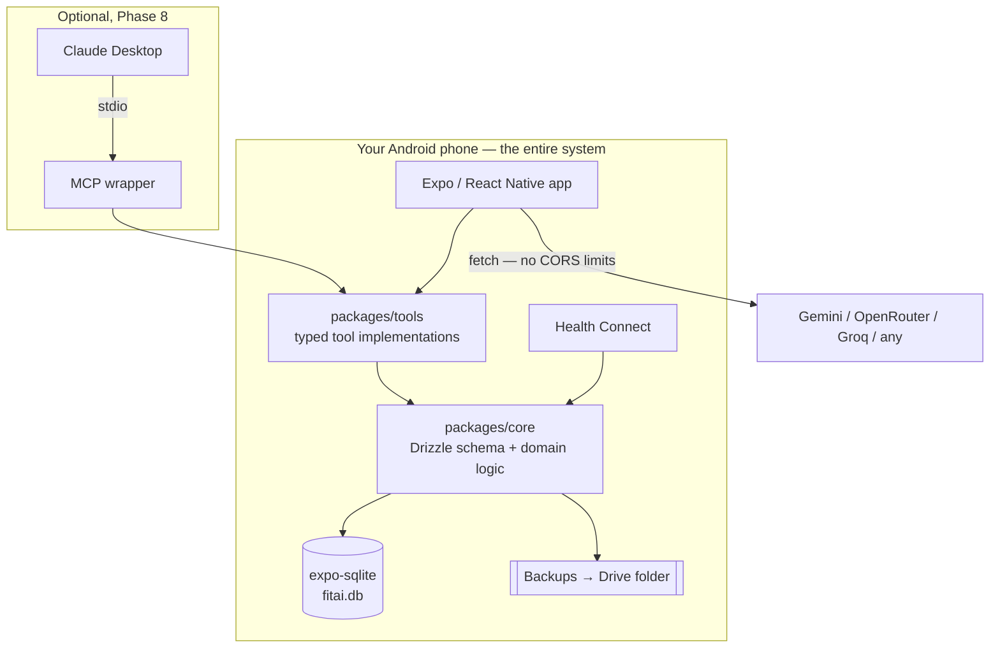

# fitai — Development Plan

An offline-first gym logger for workouts and body weight. A React Native app on your
Android phone, with no backend, no running costs, and an LLM assistant that has your
actual training history as context.

Status: **planning**. Nothing is built yet. This document is the agreed direction.

**Target: Android, React Native via Expo.** **No fixed training program** — sessions
are built ad hoc or generated. Both facts shape decisions throughout.

---

## 1. What we're building

| # | Requirement | Where |
|---|---|---|
| 1 | Log workouts on a phone, fast, mostly by hand | §6 |
| 2 | Log body weight, ideally without retyping it from Fitelo | §10 |
| 3 | Log substitutions with the date, so they're queryable | §8 |
| 4 | Zero cost, everything stored on the phone | §2, §14 |
| 5 | Ask an LLM for a replacement or a quick session, in the gym | §7, §9 |
| 6 | LLM has profile + workout + weight context | §9 |
| 7 | Free LLM to start, providers pluggable | §9 |
| 8 | Several LLMs answering concurrently, side by side | §9 |
| 9 | Rewind anything the LLM does that you don't like | §12 |

---

## 2. The backend: there isn't one

**The phone is the whole system.** A SQLite database file lives in the app's private
storage. The app reads and writes it directly. There is no server, no API, no
account, no sync service, nothing deployed anywhere.

That's what makes it free — there's nothing to pay for because nothing is running.

What would normally be "backend work" lives in `packages/core` and `packages/tools`,
running in-process on the device: the schema, the domain logic, and the typed
operations the LLM is allowed to perform.

### What React Native gains us over the PWA plan

Moving off the browser removes three constraints that shaped the earlier draft:

| | Browser (PWA) | React Native |
|---|---|---|
| Database | SQLite compiled to WASM in OPFS, with header and eviction caveats | **Native SQLite file** in the app sandbox. Ordinary, fast, never evicted. |
| LLM providers | **Restricted to providers that allow browser calls (CORS)** | **No CORS.** RN's `fetch` isn't a browser — any provider works, including ones that block web origins. |
| API key storage | Browser storage, readable by any script on the origin | **`expo-secure-store`**, backed by the Android Keystore. |
| Rest timer in background | Unreliable — no code runs when the app is closed | **`expo-notifications`** schedules through AlarmManager. Fires reliably. |
| Health Connect | Impossible | **Available** — see §10, this may solve the Fitelo problem outright. |
| Storage cleared by "clear browsing data" | Yes | No. App sandbox. |

The CORS point is worth dwelling on: in the PWA plan, provider choice was filtered by
"does it permit browser calls." That filter is gone. Every provider is now on the table.

### MCP

Unchanged from before, and worth restating: **MCP is not how the in-gym assistant works.**
MCP is a protocol for a desktop client to spawn a local process over stdio. Your phone
has no Node runtime.

The in-gym assistant is **LLM function-calling inside the app** — the app sends the
model your context plus typed tools, the model calls them, the app executes them
against local SQLite.

The tool layer is built once and exposed twice: in-app function calling (primary),
and an optional `npx @fitai/mcp` wrapper you run on a laptop against an exported
database file when you want Claude Desktop for bulk work (Phase 8).



---

## 3. Why Expo and React Native

You want to learn React Native, and for this app it's a defensible technical choice
rather than only a learning one:

1. **All three PWA limitations disappear** — background timer, Health Connect,
   storage safety — from day one, with no later migration.
2. **Health Connect may solve your original Fitelo problem properly** (§10).
3. **No CORS constraint on LLM providers**, and keys go in the Keystore.
4. **The learning is genuinely valuable.** React Native is widely used, and a
   personal project is the right place to pick it up.

**Expo specifically**, not bare React Native: managed native modules, Fast Refresh
that's comparable to Vite HMR, EAS Build for APKs without wrestling Gradle, and
first-party modules for every device capability this app needs.

### Distribution

Sideload. `eas build -p android --profile preview` produces an APK you install
directly — no Play Store, no fees. Local builds via `npx expo run:android` are
unlimited and free once Android Studio is set up.

### One thing to know up front

**Expo Go can't load arbitrary native modules.** The moment you add Health Connect
(Phase 7), you need a *development build* — `eas build --profile development` — which
is a one-time setup, not a workflow change. Phases 0–6 work fine in Expo Go.

---

## 4. Stack

TypeScript throughout — app, tools, schema, and the optional MCP wrapper share one
type system, so a workout is defined exactly once.

| Layer | Pick | Why |
|---|---|---|
| Framework | **Expo (managed) + Expo Router** | File-based navigation, typed routes, painless native modules. |
| Language | **TypeScript** | |
| Styling | **NativeWind v4** | Tailwind syntax in React Native. The closest thing to the web workflow you know. |
| Components | Custom, built on NativeWind, plus **`@gorhom/bottom-sheet`** | This app has few component types — steppers, list rows, sheets. A full UI kit (Tamagui, gluestack) is more weight than it's worth here. |
| Database | **`expo-sqlite`** | Real native SQLite. No WASM, no OPFS, no eviction. |
| DB access | **Drizzle ORM** (`drizzle-orm/expo-sqlite`) + drizzle-kit | Typed queries, real migrations, and `useLiveQuery` re-renders components when data changes. Schema stays portable if §15 ever happens. |
| Validation | **zod** | Every tool call and import. Model output is untrusted input. |
| Secrets | **`expo-secure-store`** | API keys in the Android Keystore, not plain storage. |
| Notifications | **`expo-notifications`** | Rest timer that fires when the app is closed. |
| Backups | **`expo-file-system`** (Storage Access Framework) + `expo-sharing` | Write to a Drive-synced folder you pick once. §12. |
| Health data | **`react-native-health-connect`** | Phase 7. §10. |
| Charts | **`victory-native` (XL)** | Skia-backed, smooth. Recharts is web-only. |
| Animation/gesture | **Reanimated + Gesture Handler** | Swipe-to-swap, sheet interactions. |
| Voice | **`expo-speech-recognition`** | Phase 8. |
| Testing | Vitest/Jest + React Native Testing Library; **Maestro** for E2E | |
| Builds | **EAS Build**, or local `expo run:android` | |
| MCP (Phase 8) | `@modelcontextprotocol/sdk` + better-sqlite3 | Laptop only. |

Deliberately **absent**: no server, no auth, no cloud database, no analytics SDK.
Each would be a component to secure and pay for.

### Repo layout

```
fitai/
├── apps/
│   ├── mobile/           # Expo app — the product
│   ├── viewer/           # Phase 8: tiny read-only web viewer for a laptop
│   └── mcp/              # Phase 8: optional desktop MCP wrapper
├── packages/
│   ├── core/             # Drizzle schema, migrations, domain logic
│   ├── tools/            # Typed tool impls — shared by in-app chat AND mcp
│   └── llm/              # Provider registry + context builder
├── docs/adr/             # Architecture decision records
└── PLAN.md
```

`packages/tools` is the important one: the single definition of what an LLM may do to
your data, whichever way it connects.

---

## 5. Data model

Every table carries `id` (uuid), `created_at`, `updated_at`, `deleted_at` (soft
delete). Retrofitting that trio later is painful; adding it now is free.

| Table | Purpose |
|---|---|
| `profile` | Height, birth year, goals, units, preferences. Fed to the LLM as context. |
| `exercises` | Exercise library — name, muscles, equipment, aliases. Seeded. |
| `exercise_substitutes` | Directed pairs with a quality score: "hack squat stands in for leg press". Seeded, then reinforced by your history. |
| `routines` / `routine_versions` / `routine_exercises` | Optional saved templates. **Versioned** — §8. |
| `sessions` | One gym visit. Date, `origin`, duration, bodyweight, notes. |
| `session_exercises` | An exercise performed. Holds `planned_exercise_id` + `substitution_reason` — §8 lives here. |
| `sets` | weight, reps, RPE, set type (warmup/working/drop/failure), completed. |
| `body_weights` | date, weight, `source` (`manual`/`health_connect`/`llm`/`import`), notes. |
| `chat_threads` / `chat_messages` | Chat history, with `provider_id` per message so side-by-side answers persist. |
| `change_journal` | Every mutation, with before/after and actor. §12. |
| `settings` | Preferences. **API keys live in SecureStore, not here** — §11. |

Index `sets` on `(session_exercise_id)` and `(exercise_id, created_at)` — every
"what did I lift last time" query hits those.

Realistic size: ~125 sets/week is roughly 2–5 MB/year including the journal. Storage
is a non-issue.

---

## 6. Making manual logging fast

You'll mostly log by hand, so the app is judged here. Target: **a set logged in one
tap, a full session in under 90 seconds of screen time.**

The highest-leverage idea:

> **Never show an empty form.** Opening an exercise pre-fills exactly what you did
> last time — same weight, same reps, same set count. The common case becomes
> confirmation rather than data entry.

Building on that:

1. **"Same as last time"** at the top of every exercise — one tap logs the whole thing.
2. **Repeat-set button**, bottom of screen, thumb-reachable. Most sets repeat the
   previous one. Tap, tap, tap — three sets done.
3. **Steppers, not keyboards.** `−`/`+` at a per-exercise increment (2.5 kg default,
   1 kg for lateral raises, 5 kg for deadlift). Long-press to accelerate.
4. **Auto rest timer** on set completion — a real scheduled notification, so it fires
   whether or not the app is in front. This is the concrete payoff of going native.
5. **Quick-entry text**: `bp 60x8x3` → bench press, 60 kg, 8 reps, 3 sets.
6. **Voice entry**: "bench press sixty kilos eight reps" → a confirmation chip.
7. **Fully offline.** Logging never touches the network, so a basement gym changes nothing.
8. **Body weight**: one sheet, date defaults to today, value defaults to your last
   entry. Two taps.

Items 1–4 and 7–8 are Phase 2 and carry nearly all the speed. 5–6 are Phase 8 polish.

---

## 7. Planning a session with no fixed program

You don't follow a fixed program, so "what am I doing today?" is a real question
rather than a lookup. Four ways to start, all one tap from home:

| Start mode | `origin` | What it does |
|---|---|---|
| **Repeat** | `repeat` | Re-runs a previous session, prefilled. Probably your default. |
| **Ad hoc** | `adhoc` | Empty session, add as you go. |
| **From a saved routine** | `routine` | If you've saved one. Optional, never required. |
| **Generated** | `generated` | "I have 30 minutes, build me something" — the LLM proposes a session. |

Because there's no program to fall back on, the **generate** path matters more than it
otherwise would, and needs real inputs rather than guesswork: time available,
equipment likely free, and above all **what you've actually trained recently**.
`suggest_session` reads the last two weeks, weights toward neglected muscle groups,
and avoids anything trained in the last 48 hours.

**Save-as-routine after the fact.** Rather than defining programs up front, any
session you liked gets a "save as routine" button. Templates accumulate from what you
actually did. That fits how you train.

### The plan of record

Whichever mode you start in, the session's initial exercise list is snapshotted as
that day's **plan of record**. This is what makes §8 work without a fixed program —
"substitution" needs something to have been planned, and now there always is one,
even on an ad-hoc or generated day.

---

## 8. Substitutions, and today vs. next week

Your case: the leg press is occupied, so you do hack squats, and later you want to ask
what you usually do in that situation.

A substitution is **not** a separate kind of entry. It's a normal `session_exercises`
row that remembers what it replaced:

```ts
{
  session_id:          "…",
  exercise_id:         "hack-squat",      // what you actually did
  planned_exercise_id: "leg-press",       // from the plan of record (§7)
  substitution_reason: "equipment_busy",  // busy | time | injury | preference | closed | other
}
```

In the UI: **swipe or tap Swap on any exercise**, two taps total.

1. Tap **Swap**.
2. Pick from a ranked list — substitutes you've *actually used before* first, then
   same-muscle/same-equipment candidates. Reason defaults to "equipment busy" and is
   one tap to change.

Because this is structured data rather than a free-text note, it becomes answerable —
by the in-app chat and the MCP tools alike:

- "What do I usually do when the leg press is taken?"
- "How often did I skip leg press last month, and why?"
- "Is my hack squat progressing as well as my leg press was?"

That last one only works because both exercises keep their identity. A note saying
"did hack squats instead" would lose it.

### Scope: today, or from now on?

**The rule: every LLM-driven change defaults to `scope: 'today'`. Next week is
unaffected.**

Safe, reversible, and it matches reality — the machine was busy *today*. Every tool
carries an explicit scope so the model cannot be vague:

```ts
replace_exercise({
  session_date, planned_exercise, new_exercise,
  scope: 'today' | 'routine',   // defaults to 'today'
  reason: 'equipment_busy' | 'time' | 'preference' | 'injury'
})
```

| What you say | Scope | Effect next week |
|---|---|---|
| "Leg press is taken, what instead?" | today | None |
| "No time, make it quick" | today (generated session) | None |
| "I don't like this exercise" | **ambiguous → the model asks** | Depends on your answer |
| "Swap leg press for hack squat in my program" | routine | Permanent |

Two rules on top:

- **`scope: 'routine'` always requires your confirmation.** The model proposes a diff,
  you approve it. This is a security boundary as much as a UX one — §11.
- **Promotion by pattern.** Swapped leg press → hack squat in 4 of the last 5 sessions?
  The app asks once: "Make hack squat the default?" Suggested, never automatic.

Routines are **versioned**, so editing one today doesn't make last month's sessions
retroactively look like deviations. Without versioning, history stops being
interpretable after a few months of edits.

---

## 9. The LLM layer

### Context builder

One function in `packages/llm` assembles:

- Profile (goals, experience, constraints, units)
- Last N sessions, compacted
- Body weight trend — weekly averages, not raw dailies (daily weight is noise)
- Current PRs per main lift
- Recent substitutions with reasons

It is **token-budgeted** (a target, and a defined order in which sections get trimmed),
**versioned**, and **cached** with invalidation on write. The same builder feeds the
in-app chat and the MCP prompts, so the two can't drift.

**Per-request context toggles** let you exclude profile or body weight — §11.

### Provider registry

```ts
interface LLMProvider {
  id: string;
  label: string;
  models: string[];
  stream(req: ChatRequest): AsyncIterable<Chunk>;
}
```

One adapter file plus a registry entry per provider. Nothing else changes.

**No CORS constraint** — unlike the browser plan, every provider is available. Free
options to start (verify current limits; free tiers change):

- **Google Gemini** — a genuine free tier, generous for personal use.
- **OpenRouter** — some free models, one key reaches many.
- **Groq** — free tier, very fast, which makes side-by-side feel good.
- **Ollama** on your laptop — free, unlimited, and nothing leaves your network.

Paid providers (Anthropic, OpenAI) are the same interface if you ever want one.

### Parallel, side by side

Select 2–3 providers; the app fans out with `Promise.allSettled` and streams each
response into its own column.

- **Failure is isolated** — `allSettled`, not `all`. One provider timing out leaves
  the others streaming.
- Per-column status: latency, token count, model, error state.
- Horizontal paged columns with snap, native gesture handling.
- **Pin the best answer** to save it to the thread or attach it to a workout note.

---

## 10. Body weight, Fitelo, and Health Connect

**Fitelo has no public API**, and scraping it is out — brittle, and likely against
their terms. But going native opens a path the browser plan couldn't reach.

**Health Connect** is Android's shared health store. Any fitness app can write to it,
and any app with permission can read it. **If Fitelo writes your body weight to Health
Connect, fitai can read it automatically** — no screenshots, no OCR, no scraping. Just
a supported Android API, with your explicit permission grant.

> **Action item: check whether Fitelo has a Health Connect or Google Fit toggle in its
> settings.** If it does, this solves your original requirement properly, and Phase 7
> moves up to Phase 1.

Fallbacks, in order of preference:

| Approach | Notes |
|---|---|
| **Health Connect sync** | Best. Automatic, supported, revocable. |
| **BLE smart scale** via Health Connect or direct | Works if you own one; many cheap scales use proprietary protocols. |
| **Screenshot → LLM reads it → bulk insert** | Reliable fallback. Duplicate dates skipped, so re-sending is safe. |
| **CSV export, if Fitelo offers one** | Best for a one-time backfill of history. |
| Manual entry | Two taps (§6). Always available. |

---

## 11. Security

Single user, no server, no exposed surface. The risk is low — and moving off the
browser removed the largest threat outright.

### What changed for the better

**XSS is essentially gone.** In the PWA plan, the top risk was script injection via
rendered model output — a markdown renderer allowing raw HTML turning an LLM response
into executing code. React Native has no DOM and no HTML: markdown renders to native
components, and there is no `eval` path from model text. The entire class disappears.

**API keys are properly protected.** `expo-secure-store` puts them in the Android
Keystore, hardware-backed on most modern devices — not in storage any code on the
origin could read.

### What can reach your data

| Attacker | Can they? | Why |
|---|---|---|
| Another installed app | **No** | Android app sandboxing. |
| Someone with your unlocked phone | **Yes** | Device lock is the only control. |
| Someone with your locked phone | No, in practice | Android full-disk encryption, on by default. |
| Rooted phone / malicious accessibility service | Yes | Outside what any app can defend. |

### The remaining real risks

**1. Prompt injection — the main one now, because the LLM holds write tools.**
Untrusted text reaches the model: a Fitelo screenshot's contents, an exercise name
pasted from a website. A crafted string could try to trigger a routine-wide change or
data loss.

- The confirmation gate on `scope: 'routine'` (§8) is the boundary. The model
  proposes; you approve.
- **No `delete_all`, no `execute_sql`, no general-purpose tool.** Narrow typed tools
  only — a capability that doesn't exist can't be abused.
- Every tool argument validated with zod.
- OCR'd screenshot text is data, never instructions.

**2. Supply chain.** A malicious npm package ships inside your APK with full app
permissions. Keep dependencies few, commit the lockfile, enable Dependabot, and be
cautious with community native modules.

**3. Sideloading hygiene.** Install only APKs you built yourself. Never an APK from
anywhere else claiming to be your app.

**4. Key restriction.** Free tier or a hard billing cap, so a leaked key can't cost
money. Restrict by app signature where the provider supports it.

### Not a vulnerability, but a real cost

When you use the chat, your workout history, body weight, and profile **are sent to
Google / OpenRouter / Groq**. Free tiers often reserve broader rights over submitted
data than paid tiers — check current terms. If that matters, Ollama keeps everything
on your own network, and the per-request context toggles (§9) let you ask an exercise
question without shipping your weight history.

---

## 12. Backup and rewind

Two mechanisms, because "undo what the LLM just did" and "restore last Tuesday" are
different problems.

### Change journal — undoing the LLM

Every mutation, yours or the model's, appends a row:

```ts
{ id, timestamp, actor: 'user' | 'llm', provider, tool,
  entity, before_json, after_json, batch_id }
```

One LLM turn is one `batch_id`, so **"undo that" reverts the whole turn atomically** —
not three separate undos for one instruction. Because `before_json` is stored, undo is
a direct restore, not a replay of inverse operations.

The UI is a **History screen**: reverse-chronological, actor badges —
*"Gemini modified Push A · 2 min ago · \[Undo]"*. You see exactly what the model
touched and reverse it in one tap.

Combined with preview-before-commit on routine-scope changes, most unwanted LLM edits
never land at all. The journal catches the rest.

### Snapshots — restoring a point in time

The database is one file, so a snapshot is a file copy.

- **Automatic**: after every logged session, plus daily.
- Retention: last 7 daily + 4 weekly. A few MB each — costs nothing.
- **Restore** previews the snapshot (date, session count, last entry) before you
  confirm, and takes a pre-restore snapshot first, so restoring is itself undoable.

### Getting backups off the phone

Two layers, both free:

1. **Storage Access Framework** — you pick a folder once, the app writes backups there
   with no further prompting. Point it at a Google Drive-synced folder and off-device
   backup is automatic.
2. **Android auto-backup** — with `allowBackup` enabled, Android periodically backs the
   app's data to your Google Drive on its own, invisibly, within your existing quota.

Native storage also removes the PWA's failure mode entirely: clearing Chrome's data has
no effect on an app sandbox. Only uninstalling, or clearing this app's data
specifically, touches it.

---

## 13. Phases

Each phase ends with something usable.

### Phase 0 — Foundation
Expo app scaffold, Expo Router, NativeWind, Drizzle schema and migrations (including
`routine_versions` and `change_journal` from day one), seeded exercise library,
dependency policy, ADRs for §2/§3/§8. CI running typecheck + tests.
*Done when:* the app boots on your phone and the schema migrates cleanly.

### Phase 1 — Log things
Create a session, add exercises, log sets, log body weight, browse history. Snapshots
and Drive-folder backup ship **here, not later**.
*Done when:* you log a real session on your phone in airplane mode, and a backup lands
in your Drive folder.

### Phase 2 — Make it fast
Everything in §6: last-time prefill, "same as last time", repeat-set, steppers with
per-exercise increments, **rest timer with real background notifications**, two-tap
body weight.
*Done when:* a full session takes under 90 seconds of screen time.

### Phase 3 — Sessions without a program
The four start modes in §7, plan-of-record snapshotting, save-as-routine,
recency-aware `suggest_session`.
*Done when:* starting a session never requires typing an exercise name from scratch.

### Phase 4 — Substitutions
Swap flow, history-ranked substitutes, reasons, substitution history view, routine
versioning.
*Done when:* you can swap in two taps, and "what do I do when the leg press is taken?"
has a real answer in your data.

### Phase 5 — In-app chat with tools
Context builder, one provider, streaming chat, function calling wired to
`packages/tools`, the scope model from §8, change journal + undo UI.
*Done when:* **"I have 30 minutes, build me something" and "leg press is busy, what
instead?" both work in the gym — and you can undo either.**

### Phase 6 — Multi-LLM side by side
Provider registry with 3+ adapters, parallel fan-out, column UI, pin-best-answer,
per-provider settings.
*Done when:* one question, three columns streaming together, one failing doesn't break
the others.

### Phase 7 — Health Connect
Development build, permissions flow, body-weight read and sync, dedupe against manual
entries.
*Done when:* your Fitelo weights appear in fitai without you typing them.
**Move this to Phase 1 if Fitelo turns out to write to Health Connect** — it's a core
requirement, not a nice-to-have.

### Phase 8 — Laptop viewer, MCP, polish
A small read-only web viewer that opens an exported `.db` (§3 — decoupled, can't
corrupt your data), the `npx @fitai/mcp` wrapper, charts, PR detection, quick-entry
DSL, voice entry.

Phases 1–4 are the app you'd use daily even if everything after were cancelled. That
ordering is deliberate.

---

## 14. What this costs

| Item | Cost |
|---|---|
| GitHub repo | Free |
| SQLite on your phone | Free |
| Distribution (sideloaded APK) | Free — no Play Store fee |
| EAS Build | Free tier has a monthly build quota; local `expo run:android` is unlimited |
| Backups to Google Drive | Free within existing quota |
| Gemini / OpenRouter / Groq free tiers | Free, rate-limited |
| Ollama on your laptop | Free, unlimited, offline; needs decent RAM |
| Laptop viewer hosting (Phase 8) | Free tier |
| Anthropic / OpenAI APIs | **Pay per token — no free tier.** Optional. |

**₹0 for the entire plan** on free-tier LLMs or Ollama. The only way to spend money is
deliberately adding a paid provider. Free-tier terms change — verify before relying on
them.

---

## 15. If you ever want the cloud

Not planned, not blocked. The groundwork is already in Phase 0/1:

1. **Database** — Drizzle's schema is dialect-portable. Point it at Postgres or Turso
   and migrate the file with a one-off script.
2. **Sync** — uuid keys plus `updated_at`/`deleted_at` are already there. Single user
   with one active device means last-write-wins is sufficient.
3. **Auth** — the genuinely new work, and the one item not to defer past the day the
   data gets a public URL.

Every enabling detail is nearly free now and expensive to retrofit. That's why they're
in Phase 0 despite there being no server.

---

## 16. Risks

| Risk | Mitigation |
|---|---|
| Logging isn't fast enough and you go back to a notes app | Phase 2 exists for this; its exit criterion is a stopwatch measurement, not an opinion. |
| React Native learning curve stalls Phase 1 | Expo removes most of the sharp edges, and Phases 0–6 run in Expo Go without native build setup. |
| LLM makes a change you don't want | Default `scope: 'today'`, confirmation on routine changes, full undo via journal. Three layers. |
| Prompt injection via screenshot or pasted text | Narrow typed tools, zod validation, confirmation gate on persistent changes. |
| Fitelo doesn't write to Health Connect | Screenshot import still works (§10). Requirement met, just less elegantly. |
| Free LLM tiers get restricted | Provider registry makes switching one adapter. Ollama is the floor — it can't be withdrawn. |
| Scope creep across 8 phases | Phases 1–4 are the product. 5–8 are genuinely optional. |

---

## 17. Settled decisions

| Question | Answer |
|---|---|
| Platform | **Android**, React Native via **Expo** |
| Backend | **None.** The phone is the whole system. |
| Database | `expo-sqlite` + Drizzle, one file in the app sandbox |
| Distribution | Sideloaded APK — no store, no fees |
| Training program | **None fixed** — ad-hoc and generated sessions are first-class (§7) |
| Units | kg |
| Backups | Automatic snapshots → Drive folder via SAF, plus Android auto-backup |
| Laptop access | Separate read-only viewer in Phase 8, not React Native Web |

**Open action item:** check whether Fitelo writes body weight to Health Connect. If it
does, Phase 7 moves to the front.

---

*Next step: Phase 0.*
