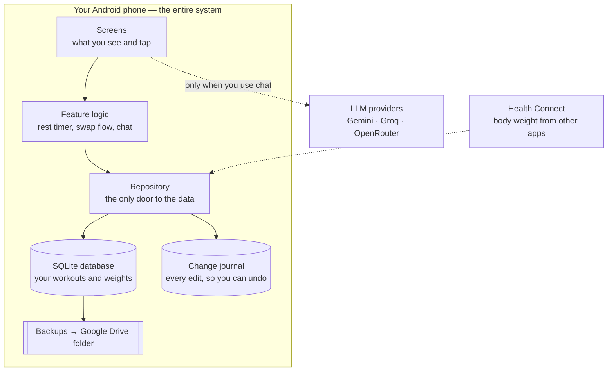
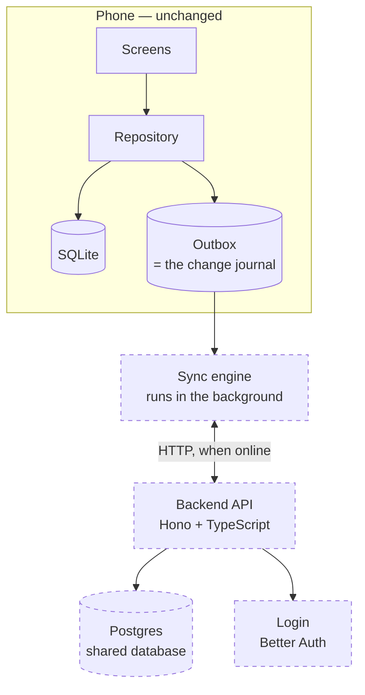
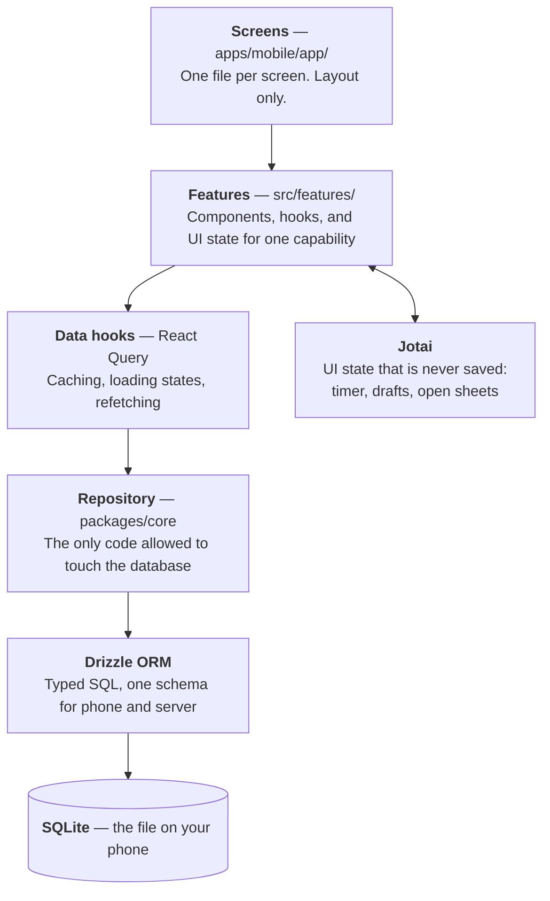
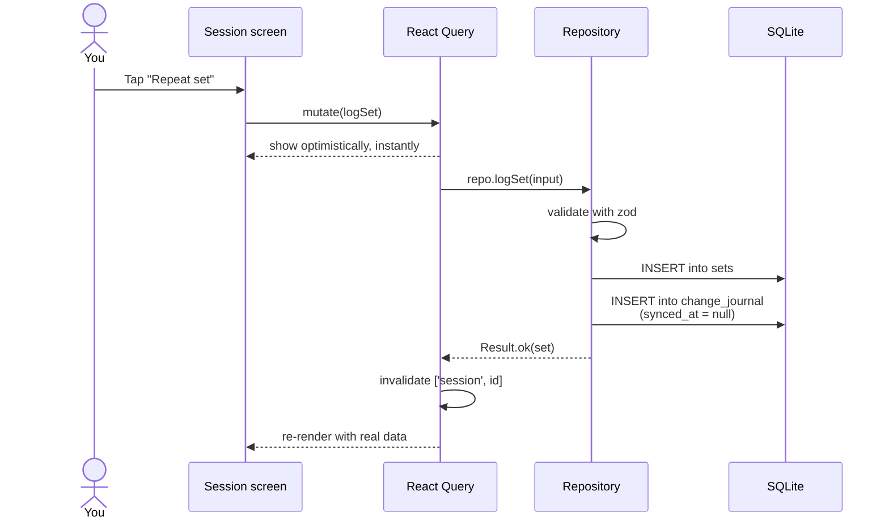
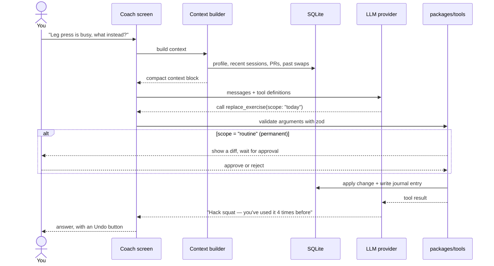
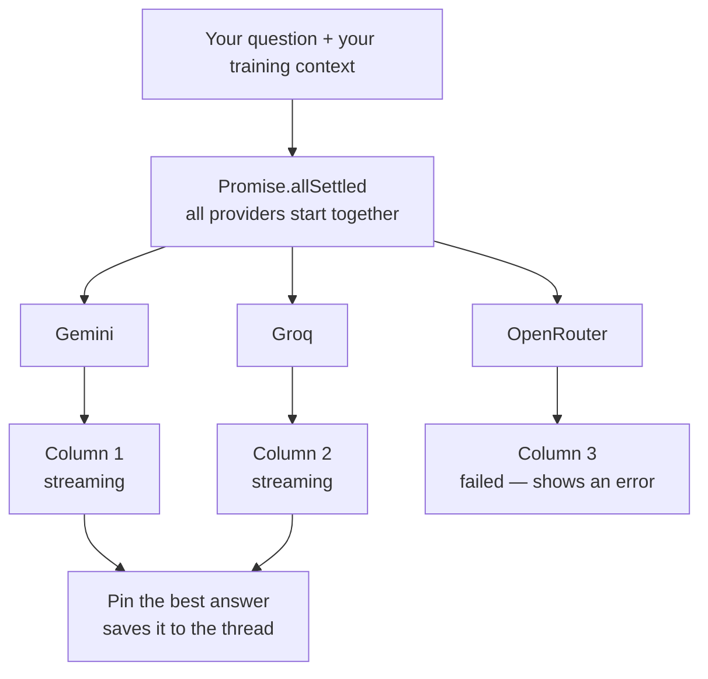
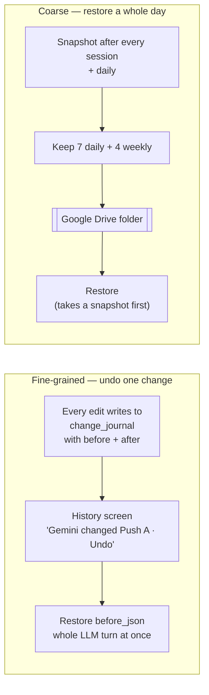

# Architecture

How fitai is put together, in diagrams and folder listings.

If you don't write code, **§1, §2 and §7 are the ones to read** — they explain what
the pieces are and where things live, in plain English.

For *why* these choices were made, see [PLAN.md](../PLAN.md).
For rules when changing code, see [CLAUDE.md](../CLAUDE.md).

---

## 1. The system, today and later

Today everything runs on your phone. There is no server anywhere.



Later, a server is added **underneath** — the app keeps writing to the phone first, so
it still works with no signal. A background sync engine catches the server up.



**The screens never change when the server arrives.** That's the point of the
repository in the middle — see §3.

---

## 2. The layers

Each layer only talks to the one below it. That's what keeps changes contained.



**The rule that makes this work:** nothing above the repository knows *where* data
lives. Swap SQLite for a server and layers 1–3 don't notice.

### Who owns which state

| State | Owner | Example |
|---|---|---|
| Anything stored in the database | **React Query** | Past sessions, sets, body weights, routines |
| Anything not stored | **Jotai** | Rest timer countdown, which sheet is open, draft values, selected LLM providers |

---

## 3. Logging a set — the most common action



Two things worth noticing:

- **No network anywhere.** This is why the app works in a basement gym.
- **Every write also lands in the change journal**, which is both your undo history
  and — later — the queue the sync engine drains.

---

## 4. Asking the LLM to swap an exercise



**The safety gate:** a change to today is applied directly. A change to a saved
routine always stops for your approval. This is what stops a bad suggestion — or a
malicious instruction hidden in a screenshot — from silently rewriting your program.

---

## 5. Asking several LLMs at once



`allSettled` rather than `all` is the whole trick: **one provider failing leaves the
others streaming.**

---

## 6. Undo and backup



---

## 7. Folder structure

Feature-first: everything for one capability lives in one folder, rather than being
scattered by file type. **Every feature folder has a `README.md` in plain English.**

```
fitai/
│
├── README.md                     ← start here
├── PLAN.md                       ← what we're building and why
├── CLAUDE.md                     ← rules for anyone (or any LLM) changing code
│
├── docs/
│   ├── ARCHITECTURE.md           ← this file
│   ├── GLOSSARY.md               ← what "RPE", "plan of record", "scope" mean
│   └── adr/                      ← decisions, numbered, with reasoning
│       ├── 0001-expo-react-native.md
│       ├── 0002-no-backend-until-phase-9.md
│       ├── 0003-repository-pattern.md
│       ├── 0004-react-query-not-uselivequery.md
│       └── 0005-substitution-scope-defaults-to-today.md
│
├── apps/
│   ├── mobile/                   ← THE APP
│   ├── api/                      ← backend (Phase 9, empty until then)
│   └── viewer/                   ← read-only laptop viewer (Phase 11)
│
└── packages/                     ← shared code, used by app and backend
    ├── contract/                 ← the API's shape, defined before the API exists
    ├── core/                     ← database schema + the repository
    ├── tools/                    ← what the LLM is allowed to do
    ├── llm/                      ← providers + context builder
    └── ui/                       ← shared visual components
```

### Inside the app

```
apps/mobile/
│
├── app/                          ← SCREENS. One file = one screen.
│   ├── (tabs)/
│   │   ├── index.tsx             ← Today
│   │   ├── history.tsx           ← Past workouts
│   │   ├── weight.tsx            ← Body weight
│   │   ├── coach.tsx             ← LLM chat
│   │   └── settings.tsx
│   ├── session/[id].tsx          ← A single workout in progress
│   └── _layout.tsx
│
├── src/
│   ├── features/                 ← ONE FOLDER PER CAPABILITY
│   │   │
│   │   ├── workout-logging/
│   │   │   ├── README.md         ← "Logging sets during a workout"
│   │   │   ├── components/
│   │   │   │   ├── SetRow.tsx
│   │   │   │   ├── WeightStepper.tsx
│   │   │   │   ├── RepeatSetButton.tsx
│   │   │   │   └── RestTimerBar.tsx
│   │   │   ├── hooks/
│   │   │   │   ├── useSession.ts
│   │   │   │   ├── useLogSet.ts
│   │   │   │   └── useLastPerformance.ts
│   │   │   ├── atoms/
│   │   │   │   └── restTimer.ts
│   │   │   └── types.ts
│   │   │
│   │   ├── body-weight/
│   │   ├── session-planning/     ← repeat / ad hoc / generated
│   │   ├── substitutions/        ← the swap flow
│   │   ├── coach-chat/           ← single and multi-LLM
│   │   ├── history-undo/         ← the change journal UI
│   │   └── backup-restore/
│   │
│   ├── shared/
│   │   ├── components/           ← Button, Sheet, EmptyState, Stepper
│   │   ├── hooks/
│   │   ├── lib/                  ← date, formatting, units
│   │   └── theme/
│   │
│   ├── data/
│   │   ├── queryClient.ts
│   │   ├── queryKeys.ts          ← every cache key in one place
│   │   └── repository.ts         ← wires the app to packages/core
│   │
│   └── providers/                ← app-wide context providers
│
├── assets/
└── app.config.ts
```

### Inside the shared packages

```
packages/
│
├── contract/                     ← Defined in Phase 0, implemented by the
│   ├── operations.ts                backend in Phase 9. Designing this now
│   ├── schemas.ts                   means the API is pre-designed.
│   └── errors.ts
│
├── core/
│   ├── schema/                   ← One table per file
│   │   ├── users.ts
│   │   ├── sessions.ts
│   │   ├── sets.ts
│   │   ├── bodyWeights.ts
│   │   ├── routines.ts
│   │   └── changeJournal.ts
│   ├── repository/
│   │   ├── WorkoutRepository.ts  ← the interface
│   │   └── LocalRepository.ts    ← the SQLite implementation
│   ├── migrations/
│   └── seed/
│       └── exercises.ts          ← the starting exercise library
│
├── tools/                        ← ONE FILE PER LLM TOOL
│   ├── logSet.ts
│   ├── replaceExercise.ts
│   ├── suggestSession.ts
│   ├── suggestSubstitutes.ts
│   ├── getLastPerformance.ts
│   └── registry.ts
│
├── llm/
│   ├── providers/                ← ONE FILE PER PROVIDER
│   │   ├── gemini.ts
│   │   ├── groq.ts
│   │   ├── openrouter.ts
│   │   └── ollama.ts
│   ├── contextBuilder.ts
│   └── registry.ts
│
└── ui/
```

### Why it's shaped this way

| Choice | Reason |
|---|---|
| Feature folders, not `components/` + `hooks/` | Everything for the swap flow is in one place. Deleting a feature means deleting one folder. |
| A `README.md` per feature | You can understand the app by reading folder names and short paragraphs, without opening a `.tsx` file |
| One file per LLM tool, one per provider | Adding either is "create a file, add a line to the registry" — nothing else to find |
| One file per database table | A schema change touches one obvious file |
| `queryKeys.ts` in one place | Cache invalidation bugs come from scattered, mistyped keys |
| `contract/` before there's a backend | The API is designed and exercised for months before it exists |

---

## 8. Where to change things

| I want to… | Go to |
|---|---|
| Change what a screen looks like | `apps/mobile/app/` |
| Change how set logging behaves | `src/features/workout-logging/` |
| Add a database column | `packages/core/schema/`, then generate a migration |
| Add something the LLM can do | `packages/tools/` + register it |
| Add a new LLM provider | `packages/llm/providers/` + register it |
| Change what the LLM knows about you | `packages/llm/contextBuilder.ts` |
| Change how data is read or written | `packages/core/repository/` — **and nowhere else** |
| Understand why something is the way it is | `docs/adr/` |
